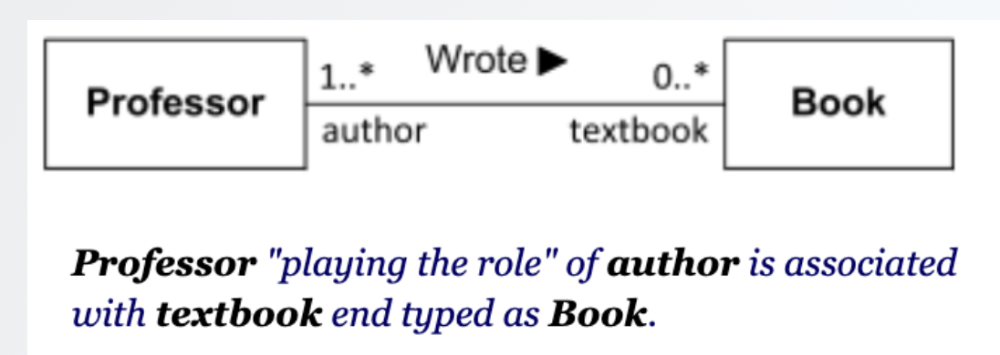

## Class Diagram
Modeling language intended to provide a standard way to visualize the design of a software system.

### Data fields visibility
- `+` Public
- `-` Private
- `#` Protected
- `/` Derived
- `~` Package (default)

### Methods
- Underline static methods
- Parameter types listed as (name: type)
- Do not include "return type" when it is void

### Class Relationships

The following diagram illustrates the types of relationships between classes in UML:

- **Association**: A general connection between two classes
- **Binary Association**: A two-class association
- **N-ary Association**: An association involving more than two classes, represented with a diamond shape.
- **Aggregation**: A whole-part relationship where parts can exist separately from the whole, indicated by an empty diamond
- **Composition**: A stronger whole-part relationship where parts cannot exist without the whole, indicated by a filled diamond
- **Inheritance**: Sometimes called *generalization*; omit trivial get/set methods
- **Implementation**: Sometimes called *realization*; write <interface> on top of the interfaces' name

For example, 
- General Association  

- Composition Association 

- Aggregation Association 

- Inheritance 

- Implementation 

Example,

