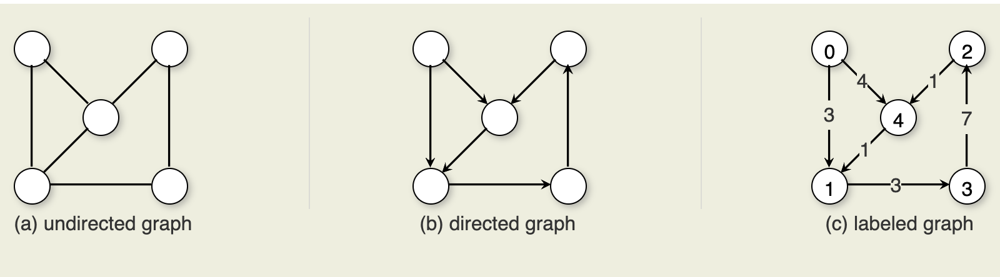
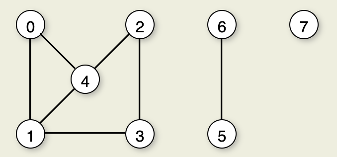
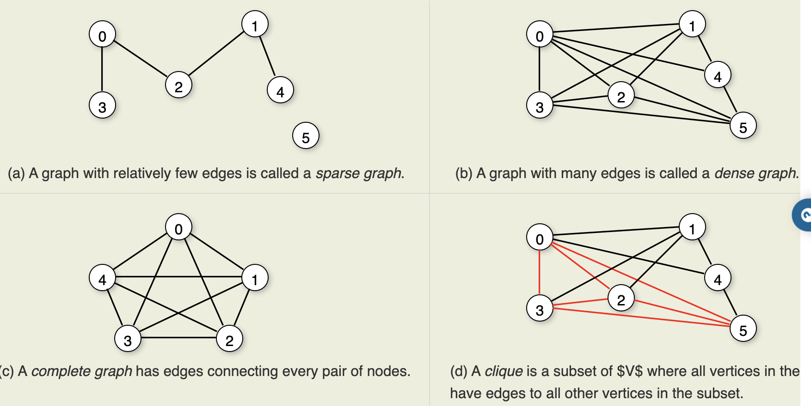
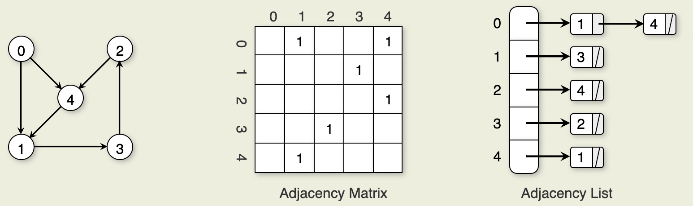
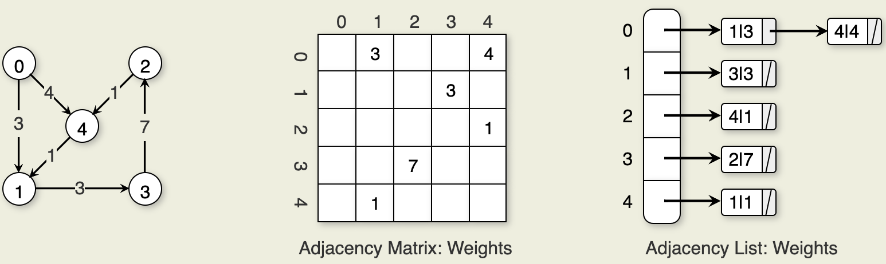

### Terminology
- A **graph** G=(V,E) consists of a set of vertices V and a set of edges E, such that each edge in E is a connection between a pair of vertices in V. The number of vertices is written |V|, and the number of edges is written |E|. |E| can range from zero to a maximum of |V|^2−|V|.

    

- The **degree** of a vertex is the number of edges it is incident with.

- A sequence of vertices v1,v2,...,vn forms a **path** of length n−1 if there exist edges from vi
 to vi+1 for `1≤i<n`. A path is a **simple path** if all vertices on the path are distinct. The **length** of a path is the number of edges it contains. A **cycle** is a path of length three or more that connects some vertex v1 to itself. A cycle is a **simple cycle** if the path is simple, except for the first and last vertices being the same.

- An undirected graph is a **connected graph** if there is at least one path from any vertex to any other. The maximally connected subgraphs of an undirected graph are called **connected components**. For example, this figure shows an undirected graph with three connected components.

    

- A graph with relatively few edges is called a **sparse graph**, while a graph with many edges is called a **dense graph**. A graph containing all possible edges is said to be a **complete graph**. 

- A **subgraph** S is formed from graph G by selecting a subset V. Any subgraph of V where all vertices in the graph connect to all other vertices in the subgraph is called a **clique**.

    

- A **free tree** is a connected, undirected graph with no simple cycles. An equivalent definition is that a free tree is connected and has |V|−1 edges.


- There are two commonly used methods for representing graphs. The **adjacency matrix** for a graph is a |V|×|V|
 array. The second common representation for graphs is the **adjacency list**. The adjacency list is an array of linked lists. The array is |V| items long, with position i storing a pointer to the linked list of edges for Vertex vi.
    

- Sometimes we want to store weights or distances with each each edge.
    

### Implementation
```
    interface Graph { // Graph class ADT
    // Initialize the graph with some number of vertices
    void init(int n);

    // Return the number of vertices
    int nodeCount();

    // Return the current number of edges
    int edgeCount();

    // Get the value of node with index v
    Object getValue(int v);

    // Set the value of node with index v
    void setValue(int v, Object val);
    
    // Adds a new edge from node v to node w with weight wgt
    void addEdge(int v, int w, int wgt);

    // Get the weight value for an edge
    int weight(int v, int w);

    // Removes the edge from the graph.
    void removeEdge(int v, int w);

    // Returns true iff the graph has the edge
    boolean hasEdge(int v, int w);

    // Returns an array containing the indicies of the neighbors of v
    int[] neighbors(int v);
    }
```

- Traverse the neighbors of a vertex
```
  int[] nList = G.neighbors(v);
  for (int i=0; i< nList.length; i++) {
    if (G.getValue(nList[i]) != VISITED) {
      DoSomething();
    }
  }
```

- Implementation for the adjacency matrix
```
    class GraphM implements Graph {
        private int[][] matrix;
        private Object[] nodeValues;
        private int numEdge;

        // No real constructor needed
        GraphM() { }

        // Initialize the graph with n vertices
        public void init(int n) {
            matrix = new int[n][n];
            nodeValues = new Object[n];
            numEdge = 0;
        }

        // Return the number of vertices
        public int nodeCount() { return nodeValues.length; }

        // Return the current number of edges
        public int edgeCount() { return numEdge; }
        
        // Get the value of node with index v
        public Object getValue(int v) { return nodeValues[v]; }
        
        // Set the value of node with index v
        public void setValue(int v, Object val) { nodeValues[v] = val; }

        // Adds a new edge from node v to node w
        // Returns the new edge
        public void addEdge(int v, int w, int wgt) {
            if (wgt == 0) { return; } // Can't store weight of 0
            if (matrix[v][w] == 0) {
            numEdge++;
            }
            matrix[v][w] = wgt;
        }

        // Get the weight value for an edge
        public int weight(int v, int w) { return matrix[v][w]; }

        // Removes the edge from the graph.
        public void removeEdge(int v, int w) {
            if (matrix[v][w] != 0) {
            matrix[v][w] = 0;
            numEdge--;
            }
        }
        
        // Returns true iff the graph has the edge
        public boolean hasEdge(int v, int w) { return matrix[v][w] != 0; }

        // Returns an array containing the indicies of the neighbors of v
        public int[] neighbors(int v) {
            int i;
            int count = 0;
            int[] temp;
            
            for (i=0; i<nodeValues.length; i++) {
            if (matrix[v][i] != 0) { count++; }
            }
            temp = new int[count];
            for (i=0, count=0; i<nodeValues.length; i++) {
            if (matrix[v][i] != 0) { temp[count++] = i; }
            }
            return temp;
        }
    }
```

- Implementation for the adjacency list
```
    public class GraphL implements Graph {

        private class Edge { // Doubly linked list node
            int vertex, weight;
            Edge prev, next;

            Edge(int v, int w, Edge p, Edge n) {
            vertex = v;
            weight = w;
            prev = p;
            next = n;
            }
        }

        private Edge[] nodeArray;
        private Object[] nodeValues;
        private int numEdge;

        // No real constructor needed
        GraphL() {}

        // Initialize the graph with n vertices
        public void init(int n) {
            nodeArray = new Edge[n];
            // List headers;
            for (int i=0; i<n; i++) { nodeArray[i] = new Edge(-1, -1, null, null); }
            nodeValues = new Object[n];
            numEdge = 0;
        }

        // Return the number of vertices
        public int nodeCount() { return nodeArray.length; }

        // Return the current number of edges
        public int edgeCount() { return numEdge; }

        // Get the value of node with index v
        public Object getValue(int v) { return nodeValues[v]; }

        // Set the value of node with index v
        public void setValue(int v, Object val) { nodeValues[v] = val; }
        
        // Return the link in v's neighbor list that preceeds the
        // one with w (or where it would be)
        private Edge find (int v, int w) {
            Edge curr = nodeArray[v];
            while ((curr.next != null) && (curr.next.vertex < w)) {
            curr = curr.next;
            }
            return curr;
        }

        // Adds a new edge from node v to node w with weight wgt
        public void addEdge(int v, int w, int wgt) {
            if (wgt == 0) { return; } // Can't store weight of 0
            Edge curr = find(v, w);
            if ((curr.next != null) && (curr.next.vertex == w)) {
            curr.next.weight = wgt;
            }
            else {
            curr.next = new Edge(w, wgt, curr, curr.next);
            numEdge++;
            if (curr.next.next != null) { curr.next.next.prev = curr.next; }
            }
        }

        // Get the weight value for an edge
        public int weight(int v, int w) {
            Edge curr = find(v, w);
            if ((curr.next == null) || (curr.next.vertex != w)) { return 0; }
            else { return curr.next.weight; }
        }

        // Removes the edge from the graph.
        public void removeEdge(int v, int w) {
            Edge curr = find(v, w);
            if ((curr.next == null) || curr.next.vertex != w) { return; }
            else {
            curr.next = curr.next.next;
            if (curr.next != null) { curr.next.prev = curr; }
            }
            numEdge--;
        }

        // Returns true iff the graph has the edge
        public boolean hasEdge(int v, int w) { return weight(v, w) != 0; }

        // Returns an array containing the indicies of the neighbors of v
        public int[] neighbors(int v) {
            int cnt = 0;
            Edge curr;
            for (curr = nodeArray[v].next; curr != null; curr = curr.next) {
            cnt++;
            }
            int[] temp = new int[cnt];
            cnt = 0;
            for (curr = nodeArray[v].next; curr != null; curr = curr.next) {
            temp[cnt++] = curr.vertex;
            }
            return temp;
        }
    }
```
