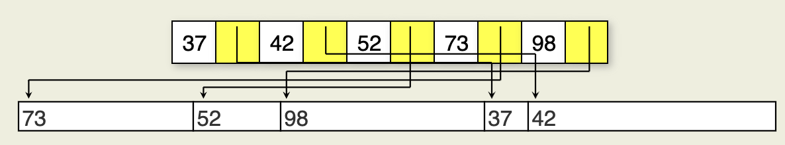

### Some Basic File-Processing terminology
- An **entry-sequenced file** stores records in the order that they were added to the file; Entry-sequenced files are the disk-based equivalent to an unsorted list and so do not support efficient search
- **Indexing** is the process of associating a key with the location of a corresponding data record; An **external sort** typically uses the concept of a key sort, in which an **index file** is created whose records consist of key/pointer pairs. Here, each key is associated with a pointer to a complete record in the main database file
- Each record of a database normally has a unique identifier, called the **primary key**
- Most searches are performed using a **secondary key**. The **secondary key inde**x (or more simply, secondary index) will associate a secondary key value with the primary key of each record having that secondary key value. 

### Linear Indexing
A **linear index** is an **index file** organized as a sequence of **key-value pairs** where the **keys** are in sorted order and the pointers either (1) point to the position of the complete record on disk, (2) point to the position of the primary key in the primary index, or (3) are actually the value of the primary key.

 

 

