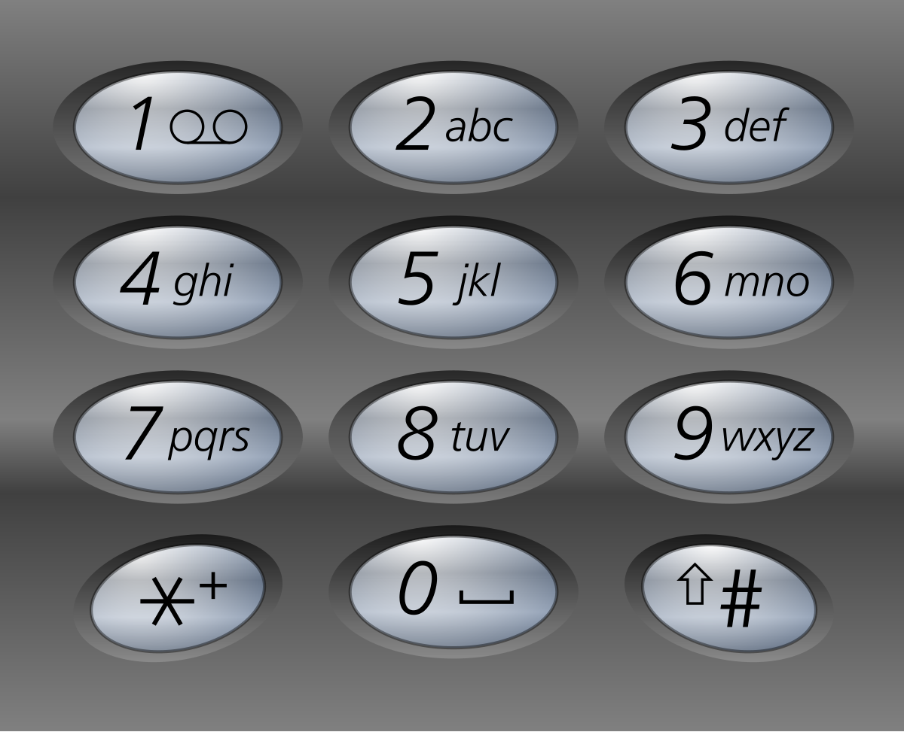
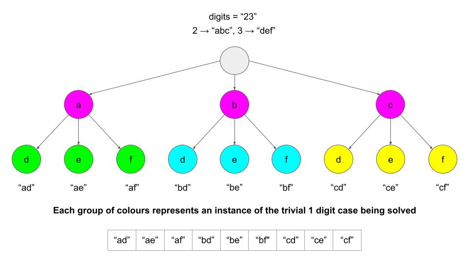

## 3. Letter Combinations of a Phone Number
🔗  Link: [Letter Combinations of a Phone Number](https://leetcode.com/problems/letter-combinations-of-a-phone-number/description/) 
💡 Difficulty: Medium 
🛠️ Topics: String, Hash, Backtracking 

======================================================================================= 
Given a string containing digits from `2-9` inclusive, return all possible letter combinations that the number could represent. Return the answer in any order.

A mapping of digits to letters (just like on the telephone buttons) is given below. Note that 1 does not map to any letters. 
 

Example 1: 
Input: digits = "23" 
Output: ["ad","ae","af","bd","be","bf","cd","ce","cf"] 

Example 2: 
Input: digits = "" 
Output: [] 

Example 3: 
Input: digits = "2" 
Output: ["a","b","c"] 

Constraints: 
- 0 <= digits.length <= 4
- digits[i] is a digit in the range ['2', '9'].

======================================================================================= 
### UMPIRE Method:
#### Understand

> - Ask clarifying questions and use examples to understand what the interviewer wants out of this problem.
> - Choose a “happy path” test input, different than the one provided, and a few edge case inputs. 
> - Verify that you and the interviewer are aligned on the expected inputs and outputs.
1. Can the input string be empty? What should I return for an empty string?
    - Yes. Simply return an empty array `[]`
2. Any requirement on time/space complexity?
3. Is there a limit to the length of the input string? Knowing the maximum possible length can help in understanding the potential solution's complexity.
    - 0 <= digits.length <= 4

### Match
> - See if this problem matches a problem category (e.g. Strings/Arrays) and strategies or patterns within the category

1. Backtracking  
Whenever we have a problem where we need to generate all combinations/permutations of some group of letters/numbers, the first thought we should have is backtracking. Backtracking algorithms can often keep the space complexity linear with the input size.

### Plan
> - Sketch visualizations and write pseudocode
> - Walk through a high level implementation with an existing diagram

 

General Idea: As we iterate through the string, we adjust the window's size and position based on the uniqueness of characters (as tracked by the set). When a repeat character is found, we move the start of the window right past the first occurrence of that character, thus maintaining the "no repeating characters" condition. The maximum size of the window during this process is the length of the longest substring without repeating characters.

1) If the input is empty, return an empty array

2) Initialize a data structure (e.g. a hash map) that maps digits to their letters, for example, mapping "6" to "m", "n", and "o"

3) Use a backtracking function to generate all possible combinations.
    - The function should take 2 primary inputs: the current combination of letters we have, `path`, and the `index` we are currently checking.
    - As a base case, if our current combination of letters is the same length as the input `digits`, that means we have a complete combination. Therefore, add it to our answer, and backtrack.
    - Otherwise, get all the letters that correspond with the current digit we are looking at,`digits[index]`.
    - Loop through these letters. For each letter, add the letter to our current `path`, and call `backtrack` again, but move on to the next digit by incrementing `index` by 1.
    - Make sure to remove the letter from `path` once finished with it.

### Implement
> - Implement the solution (make sure to know what level of detail the interviewer wants)

see solution.py

### Review
> - Re-check that your algorithm solves the problem by running through important examples
> - Go through it as if you are debugging it, assuming there is a bug
### Evaluate
> - Finish by giving space and run-time complexity
> - Discuss any pros and cons of the solution

Assume N represents the length of `digits`.

- Time Complexity: O(4^N * N), `4` in this expression is referring to the maximum value length in the hash map
- Space Complexity: O(N)
