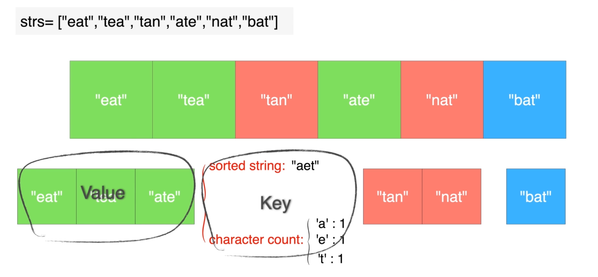
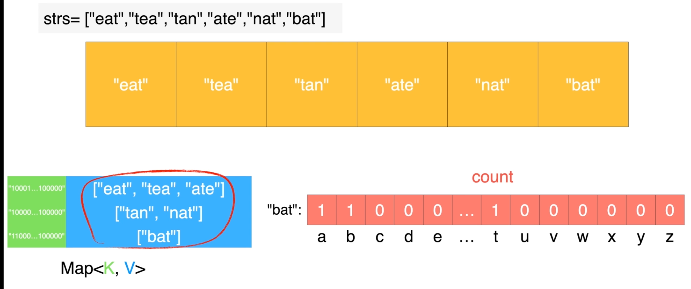

## 49. Group Anagrams
🔗  Link: [Group Anagrams](https://leetcode.com/problems/group-anagrams/description/) 
💡 Difficulty: Medium 
🛠️ Topics: Array, Sort, Hash 

======================================================================================= 
Given an array of strings `strs`, group the anagrams together. You can return the answer in any order. 
An Anagram is a word or phrase formed by rearranging the letters of a different word or phrase, typically using all the original letters exactly once.

Example 1: 
Input: strs = ["eat","tea","tan","ate","nat","bat"] 
Output: [["bat"],["nat","tan"],["ate","eat","tea"]] 

Example 2: 
Input: strs = [""] 
Output: [[""]] 

Example 3: 
Input: strs = ["a"] 
Output: [["a"]] 

Constraints: 
- 1 <= strs.length <= 10^4 
- 0 <= strs[i].length <= 100 
- strs[i] consists of lowercase English letters 
======================================================================================= 
### UMPIRE Method:
#### Understand

> - Ask clarifying questions and use examples to understand what the interviewer wants out of this problem.
> - Choose a “happy path” test input, different than the one provided, and a few edge case inputs. 
> - Verify that you and the interviewer are aligned on the expected inputs and outputs.
1. Can the input array be empty
    - YES, the return ans will be `[[""]] ` in this case.
2. Any requirement on time/space complexity?
    - Can you do better than O(NLOGN)
3. Is the array sorted? If not, is sorting a costly operation?
    - Can you do better than O(NLOGN)
4. Only ascii characters?
    - The string only contains lowercase letter
 
### Match
> - See if this problem matches a problem category (e.g. Strings/Arrays) and strategies or patterns within the category

1. Sort  
This can work if the given string in the array can be sorted. We can sort the character in the string and compare each of them since **two strings are anagrams if and only if their sorted strings are equal**. (though time complexity will be O(NlogN) if we sort it)

2. Storing the elements of the array in a HashMap 
As we sort the string, we can maintain a map `"sorted string": [list of strings having the same key]`.

### Plan
> - Sketch visualizations and write pseudocode
> - Walk through a high level implementation with an existing diagram

General Idea: Create a map to associate sorted strings (keys) with the original input strings (values). After populating the map, return the values as a list of lists.

1. Initialize a map
2. Iterate through the list of strings:
- If a string's sorted version is already a key in the map, append the string to the corresponding list
- Else, create a new key-value pair
3. Return the values as a list with `.value()`, converting them with `list()`

**Improved Gerneral Idea**: Traverse the strings and use a hashtable to store different anagram groups. Use the **character count** as the key of each group. (as image.png shown)
  
- For each string, we use an array `count` to store the occurence and number of charaters. since the string only contains lowercase letter, the size of the array is 26 and each index is mapped to a lowercase chararter
- Traverse the string, and generate another string based on the `count` array; put it as a key into the hash table along with the corresponding value (as image-1.png shown)
  
- Extract and return the values of the table as the result

### Implement
> - Implement the solution (make sure to know what level of detail the interviewer wants)

see solution.py

### Review
> - Re-check that your algorithm solves the problem by running through important examples
> - Go through it as if you are debugging it, assuming there is a bug
### Evaluate
> - Finish by giving space and run-time complexity
> - Discuss any pros and cons of the solution

Assume `N` is the length of strs and `K` is the maximum length of a string in strs.

for gerneral idea:
- Time Complexity: O(NKlogK)
- Space Complexity: O(NK)

for improved general idea:
- Time Complexity: O(N*K+N*26), traverse each strings and count the character + generate a key of size 26 == O(N*K)
- Space Complexity: O(N*K+N*26) == O(N*K)