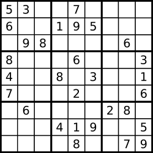

## 37. Sudoku Solver
🔗  Link: [Sudoku Solver](https://leetcode.com/problems/sudoku-solver/description/) 
💡 Difficulty: Hard 
🛠️ Topics: String, Hash, Backtracking 

======================================================================================= 
Write a program to solve a Sudoku puzzle by filling the empty cells.

A sudoku solution must satisfy all of the following rules:

1) Each of the digits 1-9 must occur exactly once in each row.
2) Each of the digits 1-9 must occur exactly once in each column.
3) Each of the digits 1-9 must occur exactly once in each of the 9 3x3 sub-boxes of the grid.

The '.' character indicates empty cells. 

Example 1: 
 
Input:  
board =  
[["5","3",".",".","7",".",".",".","."], 
["6",".",".","1","9","5",".",".","."], 
[".","9","8",".",".",".",".","6","."], 
["8",".",".",".","6",".",".",".","3"], 
["4",".",".","8",".","3",".",".","1"], 
["7",".",".",".","2",".",".",".","6"], 
[".","6",".",".",".",".","2","8","."], 
[".",".",".","4","1","9",".",".","5"], 
[".",".",".",".","8",".",".","7","9"]] 
Output:  
[["5","3","4","6","7","8","9","1","2"], 
["6","7","2","1","9","5","3","4","8"], 
["1","9","8","3","4","2","5","6","7"], 
["8","5","9","7","6","1","4","2","3"], 
["4","2","6","8","5","3","7","9","1"], 
["7","1","3","9","2","4","8","5","6"], 
["9","6","1","5","3","7","2","8","4"], 
["2","8","7","4","1","9","6","3","5"], 
["3","4","5","2","8","6","1","7","9"]] 

Constraints: 
- board.length == 9
- board[i].length == 9
- board[i][j] is a digit or '.'
- It is guaranteed that the input board has only one solution

======================================================================================= 
### UMPIRE Method:
#### Understand

> - Ask clarifying questions and use examples to understand what the interviewer wants out of this problem.
> - Choose a “happy path” test input, different than the one provided, and a few edge case inputs. 
> - Verify that you and the interviewer are aligned on the expected inputs and outputs.
1. 

### Match
> - See if this problem matches a problem category (e.g. Strings/Arrays) and strategies or patterns within the category

1. Backtracking  
Whenever we have a problem where we need to generate all combinations/permutations of some group of letters/numbers, the first thought we should have is backtracking. Backtracking algorithms can often keep the space complexity linear with the input size.

### Plan
> - Sketch visualizations and write pseudocode
> - Walk through a high level implementation with an existing diagram

General Idea:

### Implement
> - Implement the solution (make sure to know what level of detail the interviewer wants)

see solution.py

### Review
> - Re-check that your algorithm solves the problem by running through important examples
> - Go through it as if you are debugging it, assuming there is a bug
### Evaluate
> - Finish by giving space and run-time complexity
> - Discuss any pros and cons of the solution

- Time Complexity:
- Space Complexity: 
