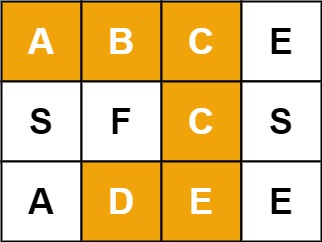

## 79. Word Search
🔗  Link: [Word Search](https://leetcode.com/problems/word-search/description/) 
💡 Difficulty: Medium 
🛠️ Topics: Array, Backtracking 

======================================================================================= 
Given an `m x n` grid of characters board and a string word, return `true` if word exists in the grid. 

The word can be constructed from letters of sequentially adjacent cells, where adjacent cells are horizontally or vertically neighboring. The same letter cell may not be used more than once. 

**Follow up**: Could you use search pruning to make your solution faster with a larger board?

Example 1: 
 
Input: board = [["A","B","C","E"], 
                ["S","F","C","S"], 
                ["A","D","E","E"]],  
                word = "ABCCED" 
Output: true 

Example 2: 
Input: board = [["A","B","C","E"], 
                ["S","F","C","S"], 
                ["A","D","E","E"]], 
                word = "SEE" 
Output: true 

Example 3: 
Input: board = [["A","B","C","E"], 
                ["S","F","C","S"], 
                ["A","D","E","E"]], 
                word = "ABCB" 
Output: false 

Constraints: 
- m == board.length
- n = board[i].length
- 1 <= m, n <= 6
- 1 <= word.length <= 15
- `board` and `word` consists of only lowercase and uppercase English letters.

======================================================================================= 
### UMPIRE Method:
#### Understand

> - Ask clarifying questions and use examples to understand what the interviewer wants out of this problem.
> - Choose a “happy path” test input, different than the one provided, and a few edge case inputs. 
> - Verify that you and the interviewer are aligned on the expected inputs and outputs.
1. Can the input `board` or `word` be empty? 
    - the smallest `board` would be 1 row and 1 column ; the shortest `word` would be 1 character long
2. Any requirement on time/space complexity?
3. What if we come across the same letter during the search path?
    - During the search path, set the visited letter as visited to avoid reuse
4. Is it possible that the word is longer than then number of possible squares in 2D-Array?
    - Yes

### Match
> - See if this problem matches a problem category (e.g. Strings/Arrays) and strategies or patterns within the category

1. Backtracking  
Backtracking is a general algorithm for finding all (or some) solutions to some computational problems, notably constraint satisfaction problems, that incrementally builds candidates to the solutions and abandons a candidate ("backtracks") as soon as it determines that the candidate cannot possibly be completed to a valid solution.

### Plan
> - Sketch visualizations and write pseudocode
> - Walk through a high level implementation with an existing diagram

General Idea: Utilize Depth-First Search (DFS) and Backtracking at each cell of the 2D grid to explore the possibility of forming the target word. Each DFS iteration either progresses towards a potential match or backtracks to explore alternative paths

1) Initial Validation:
Verify if the word's length exceeds the total number of cells in the grid.

2) Helper Function - Word Search:
    - Initiate the function with boundary checks: return `false` if the position is out of bounds or if the cell's character doesn't match the current word character
    - Confirm word completion: if the end of the word is reached, return `true`
    - Mark the current cell as visited by temporarily modifying its value to `*`
    - Recursively search adjacent cells (up, down, left, right) for the next character in the word
    - Implement Backtracking: Revert the cell to its original state after recursive exploration
    - Return the search outcome (`true` if the word is found, `false` otherwise)

3) Main Function (board, word):
    - Iterate over the grid, using the helper function to check for the word starting at each cell
    - If a match is found at any cell, return `true`
    - If all cells have been checked without finding the word, conclude that the word cannot be formed and return `false`
    

### Implement
> - Implement the solution (make sure to know what level of detail the interviewer wants)

see solution.py

### Review
> - Re-check that your algorithm solves the problem by running through important examples
> - Go through it as if you are debugging it, assuming there is a bug
### Evaluate
> - Finish by giving space and run-time complexity
> - Discuss any pros and cons of the solution

- Assume N represents the number of rows in 2D-array 
- Assume M represents the number of columns in 2D-array
- Assume L represents the number of characters in the word

- Time Complexity: O(N * M * 3 ^ L) we need to start at each character in the 2D-Array. Then we need to perform a dfs on 3 possible paths for the word. And we need to do this at each character
- Space Complexity: O(L) we may need to store the length of our word as depth in our recursion stack