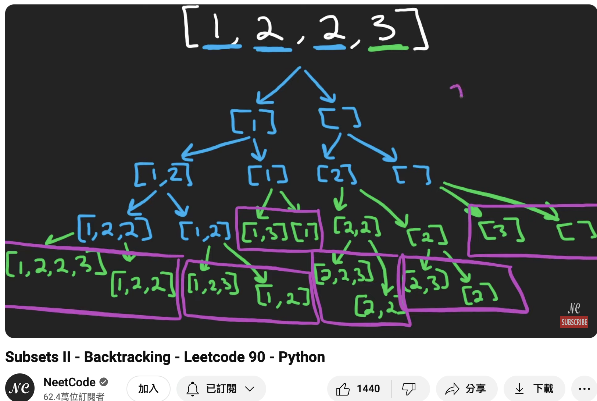

## 90. Subsets II
🔗  Link: [Subsets II](https://leetcode.com/problems/subsets-ii/) 
💡 Difficulty: Medium 
🛠️ Topics: Array, Backtracking, Sorting 

======================================================================================= 
Given an integer array `nums` that may contain duplicates, return all possible subsets(the power set).

The solution set must not contain duplicate subsets. Return the solution in any order. 

Example 1: 
Input: nums = [1,2,2] 
Output: [[],[1],[1,2],[1,2,2],[2],[2,2]] 

Example 2: 
Input: nums = [0] 
Output: [[],[0]] 

Constraints: 
- 1 <= nums.length <= 10
- -10 <= nums[i] <= 10
- All the numbers of `nums` are unique

======================================================================================= 
### UMPIRE Method:
#### Understand

> - Ask clarifying questions and use examples to understand what the interviewer wants out of this problem.
> - Choose a “happy path” test input, different than the one provided, and a few edge case inputs. 
> - Verify that you and the interviewer are aligned on the expected inputs and outputs.
1. Can the input array be empty? What should I return for an empty string?
    - Conventionally, the power set of an empty set includes just the empty set itself
2. Any requirement on time/space complexity?
3. What is the range of the size of the input array nums? Is there a maximum number of elements that nums can have?
4. Is the input array assumed to be always sorted?
    - No, do not assume array is always sorted.

### Match
> - See if this problem matches a problem category (e.g. Strings/Arrays) and strategies or patterns within the category

1. Backtracking  
In the backtracking function, add a condition to skip over duplicate elements. After choosing an element to be included in the current subset, if the next element in the array is the same as the current one, skip it to avoid creating duplicate subsets.

2. Sorting  
This step is crucial as it ensures that duplicates are adjacent, making it easier to skip over duplicates when building subsets.

### Plan
> - Sketch visualizations and write pseudocode
> - Walk through a high level implementation with an existing diagram

 

General Idea: in the `for` loop inside the `backtrack` function, there is a check to skip the current element if it's the same as the previous one (except for the first element after the `start`).

1) Initialize an Empty Result List: The method `subsetsWithDup` initializes an empty list `res` to store all subsets. Initially, `res` is set to [].

2) Sort the Array: Before starting the backtracking process, the array `nums` is sorted. 

3) Recursive Backtracking Function: The `backtrack` function is defined within `subsetsWithDup`. It iterates over the elements of the array `nums`, starting from the index `start`.

4) Building Subsets Incrementally:
    - For each index `i` in the range from `start` to the end of the array, there's a check to skip over the element if it's a duplicate of the previous element (except for the first element in each recursive call).
    - The element `nums[i]` is appended to the current subset path only if it's not a duplicate or is the first element after start.
    - After adding `nums[i]` to `path`, a copy of path is appended to `res`, capturing the current state of the subset.
    - The function then makes a recursive call to backtrack with the next index `(i + 1)`, allowing for further exploration.

5) Backtracking to Explore Other Possibilities:
    - After the recursive call, `path.pop()` is executed, which removes the last element added to path. This step is crucial as it undoes the last addition, allowing the function to backtrack and explore other subset combinations by including different elements in subsequent iterations.

6) Complete Exploration: The process continues until the function has iterated through all elements in `nums`. The sorting of `nums` and the skipping of duplicates ensure that all unique combinations are considered for inclusion in the subsets.

7) Returning the Result: Once all recursive calls are complete and all possible unique subsets have been explored and added to `res`, the `subsetsWithDup` method returns `res`. 

### Implement
> - Implement the solution (make sure to know what level of detail the interviewer wants)

see solution.py

### Review
> - Re-check that your algorithm solves the problem by running through important examples
> - Go through it as if you are debugging it, assuming there is a bug
### Evaluate
> - Finish by giving space and run-time complexity
> - Discuss any pros and cons of the solution

Assume N is the number of elements in the input array.

- Time Complexity: O(N * 2^N)
- Space Complexity: O(N * 2^N)