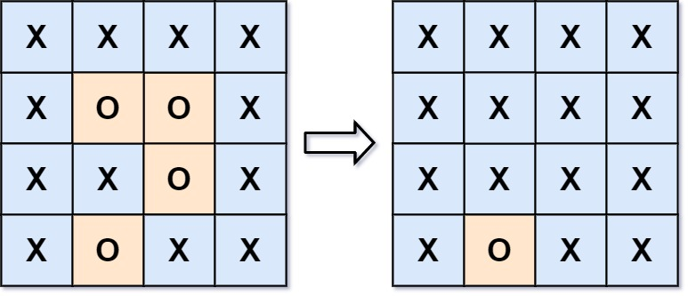

## 130. Surrounded Regions
🔗  Link: [Surrounded Regions](https://leetcode.com/problems/surrounded-regions/description/) 
💡 Difficulty: Medium 
🛠️ Topics: Matrix, DFS, BFS 

======================================================================================= 
Given an `m x n` matrix board containing `'X'` and `'O'`, capture all regions that are 4-directionally surrounded by `'X'`.

A region is captured by flipping all `'O'`s into `'X'`s in that surrounded region. 

Example 1: 
 
Input: board = [["X","X","X","X"],["X","O","O","X"],["X","X","O","X"],["X","O","X","X"]] 
Output: [["X","X","X","X"],["X","X","X","X"],["X","X","X","X"],["X","O","X","X"]] 

Explaination: 

Notice that an `'O'` should not be flipped if:
- It is on the border, or
- It is adjacent to an `'O'` that should not be flipped.

Example 2: 
Input: board = [["X"]] 
Output: [["X"]] 

Constraints: 
- m == grid.length
- n == grid[i].length
- 1 <= m, n <= 200
- `grid[i][j]` is 'O' or 'X'

======================================================================================= 
### UMPIRE Method:
#### Understand

> - Ask clarifying questions and use examples to understand what the interviewer wants out of this problem.
> - Choose a “happy path” test input, different than the one provided, and a few edge case inputs. 
> - Verify that you and the interviewer are aligned on the expected inputs and outputs.
1. Can the input grid be empty?
    - No
2. Any requirement on time/space complexity?
    - O(m * n) in time and O(1) in space 
3. Can captured regions have irregular shapes, or are they always rectangular?
    - Yes
4. Do diagonal connections between lands count towards forming an island?
    - No

### Match
> - See if this problem matches a problem category (e.g. Strings/Arrays) and strategies or patterns within the category

1. Depth-First Search (DFS)
    1) Efficiency in Exploring Connected Components: DFS is particularly efficient for exploring all nodes (cells) within a connected component of a graph (or, in this case, a 2D grid). Since the problem requires us to identify all 'O's that are connected to the border (directly or indirectly), DFS helps in thoroughly exploring all possible paths from a border 'O' without missing any
    2) Simplicity of Implementation: DFS can be implemented recursively, as shown in the `mark_escape` function
    3) Avoiding Repeated Work: Once an 'O' is visited and marked as 'E' (escaped), the DFS ensures it won't be revisited in subsequent searches. This prevents unnecessary work and ensures the algorithm runs in time proportional to the number of cells in the grid

### Plan
> - Sketch visualizations and write pseudocode
> - Walk through a high level implementation with an existing diagram

General Idea: uses a Depth-First Search (DFS) approach to efficiently explore and mark all the cells connected to the border cells that are not captured. Cells containing 'O's that are directly or indirectly connected to the borders of the board are considered "escaped" because they cannot be completely surrounded by 'X's. Therefore, they are not captured.

1) Starting from each 'O' on the border (the first and last rows, and the first and last columns), mark it and all its connected 'O's to a temporary state ('E' for escaped). This marking process uses DFS to explore each direction (up, down, left, right) from the cell, diving deep into each path until no more connected 'O's are found

2) Once all the border-connected 'O's are marked, the algorithm iterates over the entire board to finalize the state of each cell: 
    1) turning all 'O's that were not marked as 'E' (and thus are captured) into 'X's, 
    2) and reverting all 'E's back to 'O's to indicate they have escaped capture

### Implement
> - Implement the solution (make sure to know what level of detail the interviewer wants)

see solution.py

### Review
> - Re-check that your algorithm solves the problem by running through important examples
> - Go through it as if you are debugging it, assuming there is a bug
### Evaluate
> - Finish by giving space and run-time complexity
> - Discuss any pros and cons of the solution

If the grid has M rows and N columns, there are a total of M * N cells.

- Time Complexity: O(M*N)
- Space Complexity: O(M*N);