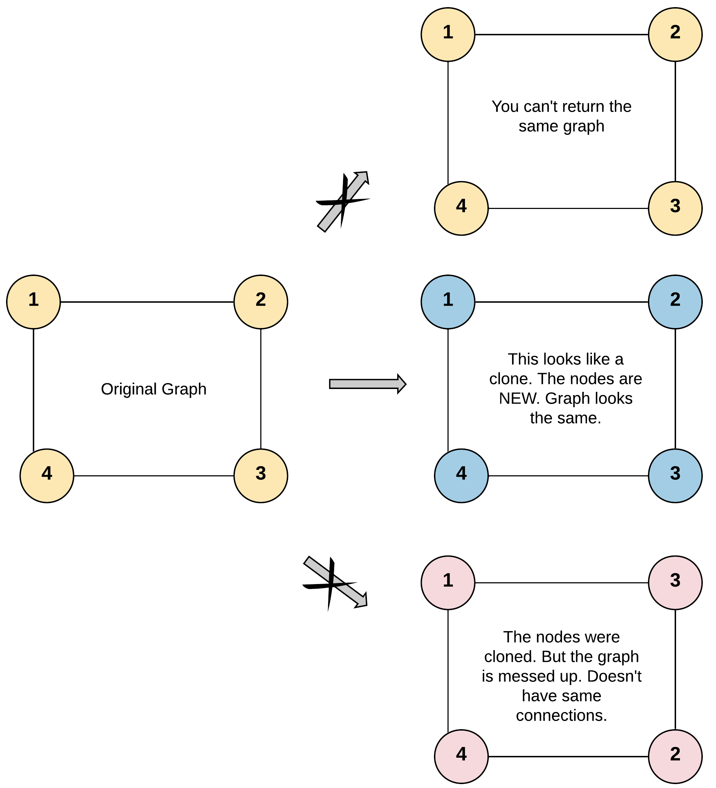
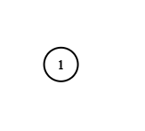

## 133. Clone Graph
🔗  Link: [Clone Graph](https://leetcode.com/problems/clone-graph/)<br>
💡 Difficulty: Medium<br>
🛠️ Topics: Graph, DFS, BFS, HashTable<br>

=======================================================================================<br>
Given a reference of a node in a connected undirected graph.<br>

Return a deep copy (clone) of the graph.<br>

Each node in the graph contains a value (int) and a list (List[Node]) of its neighbors. <br>

```
        class Node {
            public int val;
            public List<Node> neighbors;
        }
```
 

Test case format:<br>

For simplicity, each node's value is the same as the node's index (1-indexed). For example, the first node with val == 1, the second node with val == 2, and so on. The graph is represented in the test case using an adjacency list. <br>

An adjacency list is a collection of unordered lists used to represent a finite graph. Each list describes the set of neighbors of a node in the graph. <br>

The given node will always be the first node with val = 1. You must return the copy of the given node as a reference to the cloned graph. <br>


Example 1:<br>
<br>
Input: adjList = [[2,4],[1,3],[2,4],[1,3]]<br>
Output: [[2,4],[1,3],[2,4],[1,3]]<br>
Explanation: There are 4 nodes in the graph.<br>
1st node (val = 1)'s neighbors are 2nd node (val = 2) and 4th node (val = 4).<br>
2nd node (val = 2)'s neighbors are 1st node (val = 1) and 3rd node (val = 3).<br>
3rd node (val = 3)'s neighbors are 2nd node (val = 2) and 4th node (val = 4).<br>
4th node (val = 4)'s neighbors are 1st node (val = 1) and 3rd node (val = 3).<br>

Example 2:<br>

Input: adjList = [[]]<br>
Output: [[]]<br>
Explanation: Note that the input contains one empty list. The graph consists of only one node with val = 1 and it does not have any neighbors.<br>

Example 3:<br>
Input: adjList = []<br>
Output: []<br>
Explanation: This an empty graph, it does not have any nodes.<br>


Constraints:<br>
- The number of nodes in the graph is in the range `[0, 100]`.
- 1 <= Node.val <= 100
- Node.val is unique for each node.
- The Graph is connected and all nodes can be visited starting from the given node.

=======================================================================================<br>
### UMPIRE Method:
#### Understand

> - Ask clarifying questions and use examples to understand what the interviewer wants out of this problem.
> - Choose a “happy path” test input, different than the one provided, and a few edge case inputs. 
> - Verify that you and the interviewer are aligned on the expected inputs and outputs.
1. Can the graph contain cycles, or is it acyclic?
    - There are no repeated edges and no self-loops in the graph.
2. Any requirement on time/space complexity?
    - O(V + E) in time and O(1) in space 
3. Can a node in this graph have more than one neighbor?
    - Yes, a node could have any number of neighbors. This is why neighbors can be thought of as a list.
4. How do we choose how to traverse the graph?
    - Based on the kind of graph we are expecting, we can chose a BFS or DFS implementation.


### Match
> - See if this problem matches a problem category (e.g. Strings/Arrays) and strategies or patterns within the category

1. Hashmap
- A hashmap is used to keep track of cloned nodes to avoid duplicating nodes that have already been cloned. It maps original nodes to their clones, ensuring that every node in the graph is cloned exactly once
- A hashmap provides constant-time lookup on average, which is crucial for quickly checking whether a node has already been cloned and for retrieving the cloned node to update its neighbors list. This efficiency is key to keeping the overall algorithm fast

2. BFS
- BFS explores the graph level by level, starting from a given node and exploring all its neighbors before moving on to the neighbors of those neighbors. This systematic approach ensures that every node and edge is visited exactly once, which is ideal for creating a clone of the graph
- BFS guarantees that if there's a path from the starting node to any other node, it will be found. This is crucial for cloning, as we need to ensure every part of the connected component the starting node belongs to is cloned


### Plan
> - Sketch visualizations and write pseudocode
> - Walk through a high level implementation with an existing diagram

General Idea: 

1. Use a hash map to store the reference of the copy of all the nodes that have already been visited and copied. 
2. Add the first node to the queue. 
3. Do the BFS traversal.
    - Pop a node from the front of the queue.
    - Visit all the neighbors of this node.
    - If any of the neighbors was already visited then it must be present in the `visited` dictionary. Get the clone of this neighbor from `visited` in that case.
    - Add the clones of the neighbors to the corresponding list of the clone node.


### Implement
> - Implement the solution (make sure to know what level of detail the interviewer wants)

see solution.py

### Review
> - Re-check that your algorithm solves the problem by running through important examples
> - Go through it as if you are debugging it, assuming there is a bug
### Evaluate
> - Finish by giving space and run-time complexity
> - Discuss any pros and cons of the solution

Assume `V` is the number of nodes and `E` is the number of edges 
- Time Complexity: O(V + E)
- Space Complexity: O(V + E)