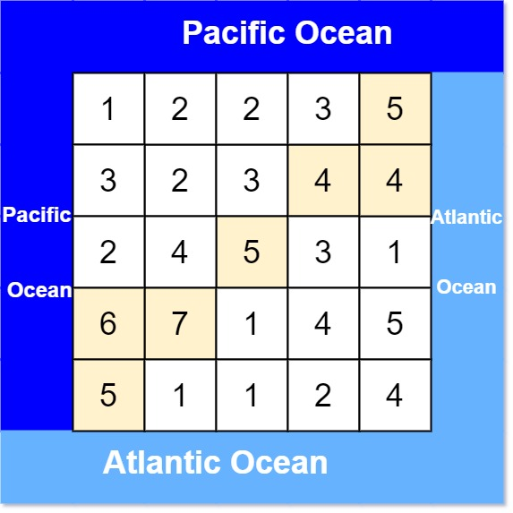

## 417. Pacific Atlantic Water Flow
🔗  Link: [Pacific Atlantic Water Flow](https://leetcode.com/problems/pacific-atlantic-water-flow/description/) 
💡 Difficulty: Medium 
🛠️ Topics: Matrix, DFS, BFS 

======================================================================================= 
There is an `m x n` rectangular island that borders both the Pacific Ocean and Atlantic Ocean. The Pacific Ocean touches the island's left and top edges, and the Atlantic Ocean touches the island's right and bottom edges.

The island is partitioned into a grid of square cells. You are given an `m x n` integer matrix `heights` where `heights[r][c]` represents the height above sea level of the cell at coordinate `(r, c)`.

The island receives a lot of rain, and the rain water can flow to neighboring cells directly north, south, east, and west if the neighboring cell's height is less than or equal to the current cell's height. Water can flow from any cell adjacent to an ocean into the ocean.

Return a 2D list of grid coordinates result where `result[i] = [ri, ci]` denotes that rain water can flow from cell `(ri, ci)` to both the Pacific and Atlantic oceans.

 

Example 1: 
 
Input: grid = heights = [[1,2,2,3,5],[3,2,3,4,4],[2,4,5,3,1],[6,7,1,4,5],[5,1,1,2,4]] 
Output: [[0,4],[1,3],[1,4],[2,2],[3,0],[3,1],[4,0]] 
Explanation: The following cells can flow to the Pacific and Atlantic oceans, as shown below: 
[0,4]: [0,4] -> Pacific Ocean  
       [0,4] -> Atlantic Ocean 
[1,3]: [1,3] -> [0,3] -> Pacific Ocean  
       [1,3] -> [1,4] -> Atlantic Ocean 
[1,4]: [1,4] -> [1,3] -> [0,3] -> Pacific Ocean  
       [1,4] -> Atlantic Ocean 
[2,2]: [2,2] -> [1,2] -> [0,2] -> Pacific Ocean  
       [2,2] -> [2,3] -> [2,4] -> Atlantic Ocean 
[3,0]: [3,0] -> Pacific Ocean  
       [3,0] -> [4,0] -> Atlantic Ocean 
[3,1]: [3,1] -> [3,0] -> Pacific Ocean  
       [3,1] -> [4,1] -> Atlantic Ocean 
[4,0]: [4,0] -> Pacific Ocean  
       [4,0] -> Atlantic Ocean 
Note that there are other possible paths for these cells to flow to the Pacific and Atlantic oceans. 

Example 2: 
Input: grid = heights = [[1]] 
Output: [[0,0]] 
Explanation: The water can flow from the only cell to the Pacific and Atlantic oceans. 

Constraints: 
- m == heights.length
- n == heights[r].length
- 1 <= m, n <= 200
- 0 <= `heights[r][c]` <= 10^5

======================================================================================= 
### UMPIRE Method:
#### Understand

> - Ask clarifying questions and use examples to understand what the interviewer wants out of this problem.
> - Choose a “happy path” test input, different than the one provided, and a few edge case inputs. 
> - Verify that you and the interviewer are aligned on the expected inputs and outputs.
1. Can the input grid be empty?
    - Let’s assume the grid is not blank
2. Any requirement on time/space complexity?
    - O(m * n) in time and O(1) in space 
3. Can islands have irregular shapes, or are they always rectangular?
    - Yes
4. Do diagonal connections between lands count towards forming an island?
    - No

### Match
> - See if this problem matches a problem category (e.g. Strings/Arrays) and strategies or patterns within the category

1. Depth-First Search (DFS)
    1) Traversal: Iterate over each cell in the grid. When a land cell ('1') is found, increment the island count and then traverse its neighboring land cells to mark the entire island

    2) Marking Visited Cells: To avoid counting the same land twice, we can mark the visited land cells by either changing their value to '0' (water) or using a separate visited structure

    3) Recursion: Implement DFS recursively. When a land cell is found, call DFS for its four adjacent (up, down, left, right) cells

    4) Edge Handling: Ensure that the DFS does not go out of bounds of the grid and only processes land cells

    5) Complexity: Time complexity would be O(mn) where m is the number of rows and n is the number of columns, since each cell is processed once. The space complexity depends on the recursion depth, which can be up to O(mn) in the worst case (completely filled with land)

### Plan
> - Sketch visualizations and write pseudocode
> - Walk through a high level implementation with an existing diagram

General Idea: To find cells that can simultaneously reach both the Pacific and Atlantic oceans, we first identify cells that can reach the Pacific Ocean and those that can reach the Atlantic Ocean. **The intersection of these two sets** gives us cells with access to both oceans.

1) Main Function:

    1) Prepare for DFS Exploration:
        - Define a helper DFS function to explore the grid
    2) Initialization:
        - Initialize two sets, `pacific_reachable` and `atlantic_reachable`, to track cells that can reach the Pacific and Atlantic Oceans, respectively
        - Define `rows` and `cols` to store the dimensions of the matrix, and `directions` for exploring adjacent cells
    3) Border Exploration:
        - Iterate over the matrix's perimeter—specifically, the top and bottom rows for the Pacific and Atlantic Oceans, respectively, and the leftmost and rightmost columns for the same purpose
    4) DFS Invocation:
        - For each cell on the matrix's border, invoke the DFS function to explore inward. Cells on the top row and leftmost column are considered reachable by the Pacific Ocean, while those on the bottom row and rightmost column are reachable by the Atlantic Ocean
    5) Identify Intersecting Cells:
        - Determine the intersection of `pacific_reachable` and `atlantic_reachable` sets to find cells that can reach both oceans
        - Convert this intersection into a list and return it as the result
        
2) Helper DFS Function:

    1) Base Case Check:
        - Immediately return if the current cell is out of bounds or has already been marked as reachable for the current ocean
    2) Marking and Exploration:
        - Mark the current cell as reachable by adding it to the relevant set (`pacific_reachable` or `atlantic_reachable`)
        - Explore all four adjacent cells (up, down, left, right) from the current cell
        - For each adjacent cell, check if it is **within bounds, unvisited, and has a height greater than or equal to the current cell** (ensuring water flow from the adjacent cell to the current cell)
            - If all conditions are met, recursively apply DFS on the adjacent cell

### Implement
> - Implement the solution (make sure to know what level of detail the interviewer wants)

see solution.py

### Review
> - Re-check that your algorithm solves the problem by running through important examples
> - Go through it as if you are debugging it, assuming there is a bug
### Evaluate
> - Finish by giving space and run-time complexity
> - Discuss any pros and cons of the solution

If the grid has M rows and N columns, there are a total of M * N cells.

- Time Complexity: O(M*N)
- Space Complexity: O(M*N); the cost of storing the touches Pacific and touches Atlantic sets may contain all the items in the 2D-Array.