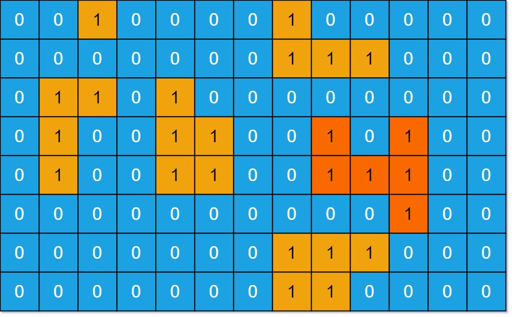

## 695. Max Area of Island
🔗  Link: [Max Area of Island](https://leetcode.com/problems/max-area-of-island/description/) 
💡 Difficulty: Medium 
🛠️ Topics: Matrix, DFS, BFS 

======================================================================================= 
You are given an `m x n` binary matrix grid. An island is a group of `1`'s (representing land) connected **4-directionally** (horizontal or vertical.) You may assume all four edges of the grid are surrounded by water.

The **area** of an island is the number of cells with a value **1** in the island.

Return the *maximum* area of an island in grid. If there is no island, return *0*. 

Example 1: 
 
Input: grid = [[0,0,1,0,0,0,0,1,0,0,0,0,0],[0,0,0,0,0,0,0,1,1,1,0,0,0],[0,1,1,0,1,0,0,0,0,0,0,0,0],[0,1,0,0,1,1,0,0,1,0,1,0,0],[0,1,0,0,1,1,0,0,1,1,1,0,0],[0,0,0,0,0,0,0,0,0,0,1,0,0],[0,0,0,0,0,0,0,1,1,1,0,0,0],[0,0,0,0,0,0,0,1,1,0,0,0,0]] 
Output: 6 
Explanation: The answer is not 11, because the island must be connected 4-directionally.

Example 2: 
Input: grid = [[0,0,0,0,0,0,0,0]] 
Output: 0 
Explanation: There is no island found.

Constraints: 
- m == grid.length
- n == grid[i].length
- 1 <= m, n <= 50
- `grid[i][j]` is '0' or '1'.

======================================================================================= 
### UMPIRE Method:
#### Understand

> - Ask clarifying questions and use examples to understand what the interviewer wants out of this problem.
> - Choose a “happy path” test input, different than the one provided, and a few edge case inputs. 
> - Verify that you and the interviewer are aligned on the expected inputs and outputs.
1. Can the input grid be empty?
    - No
2. Any requirement on time/space complexity?
    - O(m * n) in time and O(1) in space 
3. Can islands have irregular shapes, or are they always rectangular?
    - Yes
4. Do diagonal connections between lands count towards forming an island?
    - No

### Match
> - See if this problem matches a problem category (e.g. Strings/Arrays) and strategies or patterns within the category

1. Depth-First Search (DFS)
    1) Traversal: Iterate over each cell in the grid. When a land cell ('1') is found, increment the island count and then traverse its neighboring land cells to mark the entire island

    2) Marking Visited Cells: To avoid counting the same land twice, we can mark the visited land cells by either changing their value to '0' (water) or using a separate visited structure

    3) Recursion: Implement DFS recursively. When a land cell is found, call DFS for its four adjacent (up, down, left, right) cells

    4) Edge Handling: Ensure that the DFS does not go out of bounds of the grid and only processes land cells

    5) Complexity: Time complexity would be O(mn) where m is the number of rows and n is the number of columns, since each cell is processed once. The space complexity depends on the recursion depth, which can be up to O(mn) in the worst case (completely filled with land)

2. Breadth-First Search (BFS)
    - TODO

### Plan
> - Sketch visualizations and write pseudocode
> - Walk through a high level implementation with an existing diagram

General Idea: use a Depth-First Search (DFS) approach to explore the grid and identify the islands; mark the island by changing its value and keep track of the number of island using variable *count*

1) Initialize Variables:
    - Determine the number of rows and columns in the grid
    - Set `result` to 0, which will eventually hold the maximum island area
    - Define directions as a list of tuples representing the four cardinal directions (up, down, left, right) to explore from a given cell

2) Define Depth-First Search (DFS) Function:
    - The DFS function takes a cell's row and column indices (`row`, `col`), and `count` as arguments. `count` keeps track of the area of the current island being explored
    - Mark the current cell as visited by setting its value to `0` in the grid
    - Increment `count` to account for the current cell being part of the island
    - Iterate over the directions to explore adjacent cells
        - For each direction, calculate the new row and column indices and check if they are within bounds and if the cell is part of an island (i.e., its value is 1)
        - If the conditions are met, recursively call the DFS function for the new cell, updating `count` with the return value to include the area discovered through that path
    - Return the `count` after exploring all valid directions, representing the total area of the island connected to the initial cell

3) Iterate Over the Grid:
    - Loop through each cell in the grid
        - If a cell is part of an island (its value is `1`), initiate a DFS search from that cell with the initial count set to `0`. This explores the entire island, marking its cells as visited and calculating its area
    - Update `result` with the maximum of its current value and the size of the island discovered by the DFS call. This ensures `result` always holds the maximum island area found so far

4) Return Result:
After all cells have been explored and all islands have been measured, return `result`, which now contains the area of the largest island in the grid.

### Implement
> - Implement the solution (make sure to know what level of detail the interviewer wants)

see solution.py

### Review
> - Re-check that your algorithm solves the problem by running through important examples
> - Go through it as if you are debugging it, assuming there is a bug
### Evaluate
> - Finish by giving space and run-time complexity
> - Discuss any pros and cons of the solution

If the grid has M rows and N columns, there are a total of M * N cells.

- Time Complexity: O(M*N)
- Space Complexity: O(M*N); The main space consumption in the algorithm comes from the recursion stack used in DFS. In the worst case (when the grid is entirely filled with land), the maximum depth of the recursive call stack could be m * n, in scenarios where DFS traverses the entire grid.