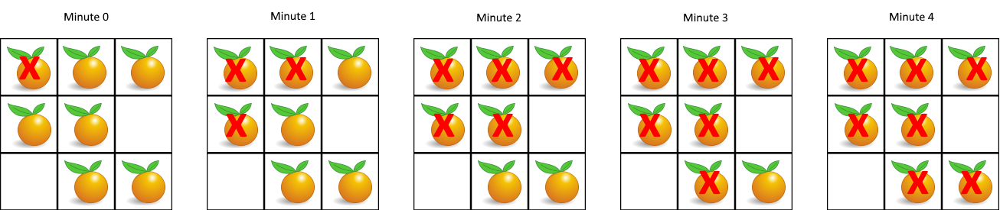

## 994. Rotting Oranges
🔗  Link: [Rotting Oranges](https://leetcode.com/problems/rotting-oranges/description/) 
💡 Difficulty: Medium 
🛠️ Topics: Matrix, DFS, BFS 

======================================================================================= 
You are given an `m x n` grid where each cell can have one of three values:

- `0` representing an empty cell,
- `1` representing a fresh orange, or
- `2` representing a rotten orange

Every minute, any fresh orange that is 4-directionally adjacent to a rotten orange becomes rotten.

Return the minimum number of minutes that must elapse until no cell has a fresh orange. If this is impossible, return `-1`. 

Example 1: 
 
Input: grid = [[2,1,1],[1,1,0],[0,1,1]] 
Output: 4 

Example 2: 
Input: grid = [[2,1,1],[0,1,1],[1,0,1]] 
Output: -1 
Explanation: The orange in the bottom left corner (row 2, column 0) is never rotten, because rotting only happens 4-directionally. 

Example 3:
Input: grid = [[0,2]] 
Output: 0 
Explanation: Since there are already no fresh oranges at minute 0, the answer is just 0. 

Constraints: 
- m == grid.length
- n == grid[i].length
- 1 <= m, n <= 10
- `grid[i][j]` is `0` or `1` or `2`

======================================================================================= 
### UMPIRE Method:
#### Understand

> - Ask clarifying questions and use examples to understand what the interviewer wants out of this problem.
> - Choose a “happy path” test input, different than the one provided, and a few edge case inputs. 
> - Verify that you and the interviewer are aligned on the expected inputs and outputs.
1. Can the input grid be empty?
    - No
2. Any requirement on time/space complexity?
    - O(m * n) in time and O(1) in space 
3. Can islands have irregular shapes, or are they always rectangular?
    - Yes
4. Do diagonal connections between lands count towards forming an island?
    - No
5. What is a possible edge case?
    - That there is no fresh, there is no rotten

### Match
> - See if this problem matches a problem category (e.g. Strings/Arrays) and strategies or patterns within the category

1. Breadth-First Search (BFS)
    - Level-by-Level Processing: BFS processes nodes *level by level*, moving outward from the source. In the context of rotting oranges, this means processing all oranges that become rotten at the same time, simulating the passage of time in discrete units (minutes). This aligns perfectly with the problem's requirement to calculate the minimum time until no fresh oranges remain
    - Shortest Path: BFS is inherently a shortest path algorithm in unweighted graphs or grids, finding the shortest path from a source node to all other nodes. When applied to the grid of oranges, it *ensures that the time calculated to rot all oranges is the minimum possible*, as it immediately rots all neighboring fresh oranges at each step, without unnecessary delays
    - Simultaneous Spread: The problem describes a scenario where the rot spreads simultaneously from all rotten oranges to their adjacent fresh oranges. **BFS naturally simulates this spreading process by including all newly rotten oranges in the queue** and processing them in the order they were added, thus accurately modeling the simultaneous spread of rot
    - Determining Infeasibility: With BFS, it's straightforward to determine if there are fresh oranges that cannot be reached (and thus, cannot be rotted) by any rotten oranges. I**f, after the BFS completes, there are still fresh oranges left, it means these oranges are isolated from rotten ones**, and the function can return an indication that it's impossible to rot all oranges.

### Plan
> - Sketch visualizations and write pseudocode
> - Walk through a high level implementation with an existing diagram

General Idea: employ a Breadth-First Search (BFS) algorithm, leveraging a queue to track and process rotten oranges in order to propagate the rot to adjacent fresh oranges in discrete time steps, ultimately calculating the minimum time or indicating impossibility if any fresh orange remains unreachable

1) Initialize Variables: 

Determine the dimensions of the grid and initialize variables to keep track of the count of fresh oranges, the total time elapsed (result), and a queue to hold the positions (coordinates) of initially rotten oranges.

2) **Scan the Grid**: 

Iterate through the grid to count the number of fresh oranges and populate the queue with the positions of rotten oranges.

3) BFS Traversal:

- While there are rotten oranges in the queue and there are still fresh oranges:
    - Increment the time elapsed (result) by one unit to simulate the passage of time
    - For each rotten orange currently in the queue (these represent oranges that became rotten at the current time step):
        - Remove it from the queue
        - Check its four adjacent cells (up, down, left, right):
            - If an adjacent cell contains a fresh orange:
                1) change it to rotten
                2) decrement the count of fresh oranges
                3) add its position to the queue for processing in the next time step

4) Check for Unreachable Fresh Oranges: 

After the BFS traversal, if there are still fresh oranges left, it means they are unreachable and cannot be rotted. In this case, return `-1` to indicate it's impossible to rot all oranges.

5) Return Result: 

If all fresh oranges have been rotted, return the total time elapsed as the result. This time represents the minimum number of time units required to rot all reachable fresh oranges.

### Implement
> - Implement the solution (make sure to know what level of detail the interviewer wants)

see solution.py

### Review
> - Re-check that your algorithm solves the problem by running through important examples
> - Go through it as if you are debugging it, assuming there is a bug
### Evaluate
> - Finish by giving space and run-time complexity
> - Discuss any pros and cons of the solution

If the grid has M rows and N columns, there are a total of M * N cells.

- Time Complexity: O(M*N)
- Space Complexity: O(M*N)