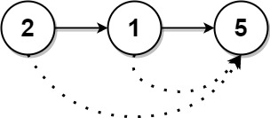

## 1019. Next Greater Node In Linked List
🔗  Link: [Next Greater Node In Linked List](https://leetcode.com/problems/next-greater-node-in-linked-list/description/) 
💡 Difficulty: Medium 
🛠️ Topics: Linked List, Stack 

======================================================================================= 
You are given the `head` of a linked list with `n` nodes. 

For each node in the list, find the value of the next greater node. That is, for each node, find the value of the first node that is next to it and has a strictly larger value than it. 

Return an integer array `answer` where `answer[i]` is the value of the next greater node of the `ith` node (**1-indexed**). If the `ith` node does not have a next greater node, set `answer[i] = 0`. 

Example 1: 

Input: head = [2,1,5] 
Output: [5,5,0] 

Example 2: 
Input: head = [2,7,4,3,5] 
Output: [7,0,5,5,0] 

Constraints: 
- The number of nodes in the list is n
- 1 <= n <= 10^4
- 1 <= Node.val <= 109

======================================================================================= 
### UMPIRE Method:
#### Understand

> - Ask clarifying questions and use examples to understand what the interviewer wants out of this problem.
> - Choose a “happy path” test input, different than the one provided, and a few edge case inputs. 
> - Verify that you and the interviewer are aligned on the expected inputs and outputs.
1. Can the input be empty? (head is null?)
    - No
2. Any requirement on time/space complexity?
    - O(N) in time and O(N) in space 
3. Does the linked list have a cycle?
    - No

### Match
> - See if this problem matches a problem category (e.g. Strings/Arrays) and strategies or patterns within the category

1. Stack
To find the next greater node for each node in the list, a common approach is to use a stack that helps track the indices (or positions) of nodes where the next greater node hasn't been found yet

### Plan
> - Sketch visualizations and write pseudocode
> - Walk through a high level implementation with an existing diagram

General Idea: 

1. Convert Linked List to Array
- we first **converts the linked list into an array for ease of access.** Linked lists do not support direct indexing, which makes it hard to compare the current node's value with the following nodes'. By converting it into an array, the function can easily access any element by its index.

2. Initialize Answer Array
- An answer array is initialized with the same length as the array representation of the linked list, filled with zeros
- This array will eventually hold the next greater value for each node. 
- If a node does not have a next greater value, its corresponding position in the answer array will remain 0.

3. Use a Stack for Indices
- We uses a stack to **keep track of indices in the array** for which it hasn't yet found a next greater element. 
- The stack is particularly useful for efficiently finding the next greater element for each node, as it allows for *quick access to indices* that are pending examination for a next greater element.

4. Iterate Through the Array
- The function iterates through the array representation of the linked list. 
- For each element, it checks if the stack is not empty and if the current element's value is greater than the value at the index located at the top of the stack. 
- If both conditions are true, it means the function has found a next greater element for the node corresponding to the top index in the stack.

5. Update Answer Array and Stack Operations
- Upon finding a next greater element, the function pops the top index from the stack and updates the corresponding position in the answer array with the current element's value. 
- Regardless of whether a next greater element is found, the current index is pushed onto the stack. 
- This indicates that the function is still looking for a next greater element for this node.

6. Return the Answer Array
- Finally, after iterating through the entire array and updating the answer array with next greater values wherever applicable, the function returns the answer array.

### Implement
> - Implement the solution (make sure to know what level of detail the interviewer wants)

see solution.py

### Review
> - Re-check that your algorithm solves the problem by running through important examples
> - Go through it as if you are debugging it, assuming there is a bug
### Evaluate
> - Finish by giving space and run-time complexity
> - Discuss any pros and cons of the solution

Assume N represents the number of nodes in the linked list.

- Time Complexity: O(N); During this iteration, each element is compared and possibly added to the stack once.
- Space Complexity: O(N)
