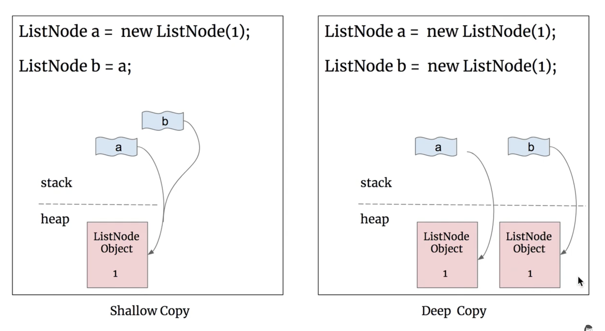
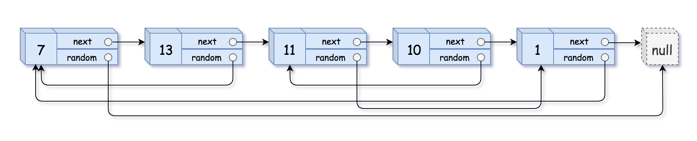

## 138. Copy List with Random Pointer
🔗  Link: [Copy List with Random Pointer](https://leetcode.com/problems/copy-list-with-random-pointer/description/) 
💡 Difficulty: Medium 
🛠️ Topics: Linked List, Hashmap 

======================================================================================= 
A linked list of length `n` is given such that each node contains an additional random pointer, which could point to any node in the list, or `null`. 

 
Construct a *deep copy* of the list. The deep copy should consist of exactly `n` brand new nodes, where each new node has its value set to the value of its corresponding original node. Both the `next` and `random` pointer of the new nodes should point to new nodes in the copied list such that the pointers in the original list and copied list represent the same list state. None of the pointers in the new list should point to nodes in the original list. 

For example, if there are two nodes `X` and `Y` in the original list, where `X.random --> Y`, then for the corresponding two nodes `x` and `y` in the copied list, `x.random --> y`. 

Return the head of the copied linked list. 

The linked list is represented in the input/output as a list of `n` nodes. Each node is represented as a pair of `[val, random_index]` where:

- `val`: an integer representing `Node.val`
- `random_index`: the index of the node (`range from 0 to n-1`) that the random pointer points to, or `null` if it does not point to any node.
**nootes** random_index is a pointer to the node 
Your code will only be given the head of the original linked list. 

Example 1: 

Input: head = [[7,null],[13,0],[11,4],[10,2],[1,0]] 
Output: [[7,null],[13,0],[11,4],[10,2],[1,0]] 

Constraints: 
- 0 <= n <= 1000^6
- 10^4 <= Node.val <= 10^4
- Node.random is null or is pointing to some node in the linked list.
======================================================================================= 
### UMPIRE Method:
#### Understand

> - Ask clarifying questions and use examples to understand what the interviewer wants out of this problem.
> - Choose a “happy path” test input, different than the one provided, and a few edge case inputs. 
> - Verify that you and the interviewer are aligned on the expected inputs and outputs.
1. Can the input be empty? (head is null?)
    - Yes
2. Any requirement on time/space complexity?
    - O(N) in time and O(N) in space 
3. Does the linked list have a cycle?
    - No

### Match
> - See if this problem matches a problem category (e.g. Strings/Arrays) and strategies or patterns within the category

1. Hashmap
use Hashmap to keep track of the already copied nodes and to quickly find the corresponding new node for setting the next and random pointers without needing to traverse the new list each time

### Plan
> - Sketch visualizations and write pseudocode
> - Walk through a high level implementation with an existing diagram

General Idea: first save node to hashmap and then add pointer to each copy node

1) If the list is empty (head == null), it returns `null`
2) Create a hashmap to *store the mapping* from the original nodes to their corresponding new nodes
3) Iterates over the original list (loop 1) and creates a new node for each original node, **storing this relationship in the hashmap**
4) Iterates over the list again (loop 2) to set the `next` and `random` pointers for the nodes in the new list by using the hashmap
5) Finally, return the new head of the copied list

### Implement
> - Implement the solution (make sure to know what level of detail the interviewer wants)

see solution.py

### Review
> - Re-check that your algorithm solves the problem by running through important examples
> - Go through it as if you are debugging it, assuming there is a bug
### Evaluate
> - Finish by giving space and run-time complexity
> - Discuss any pros and cons of the solution

Assume `N` is the length of the linked list

- Time Complexity: O(N)
- Space Complexity: O(N)