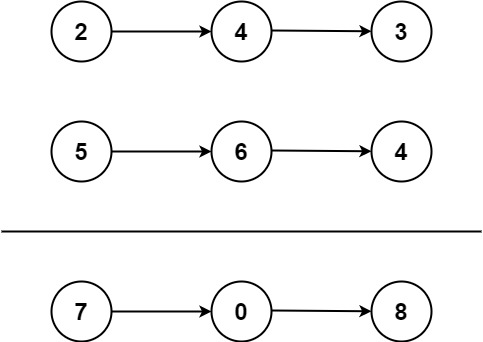

## 2. Add Two Numbers
🔗  Link: [Add Two Numbers](https://leetcode.com/problems/add-two-numbers/description/) 
💡 Difficulty: Medium 
🛠️ Topics: Linked List, Recursion 

======================================================================================= 
You are given two non-empty linked lists representing two non-negative integers. The digits are stored in reverse order, and each of their nodes contains a single digit. Add the two numbers and return the sum as a linked list. 

You may assume the two numbers do not contain any leading zero, except the number 0 itself. 

Example 1: 
 
Input: l1 = [2,4,3], l2 = [5,6,4] 
Output: [7,0,8] 
Explanation: 342 + 465 = 807. 

Example 2: 
Input: l1 = [0], l2 = [0] 
Output: [0] 

Example 3: 
Input: l1 = [9,9,9,9,9,9,9], l2 = [9,9,9,9] 
Output: [8,9,9,9,0,0,0,1] 

Constraints: 
- The number of nodes in each linked list is in the range `[1, 100]`
- 0 <= Node.val <= 9
- It is guaranteed that the list represents a number that does not have leading zeros

======================================================================================= 
### UMPIRE Method:
#### Understand

> - Ask clarifying questions and use examples to understand what the interviewer wants out of this problem.
> - Choose a “happy path” test input, different than the one provided, and a few edge case inputs. 
> - Verify that you and the interviewer are aligned on the expected inputs and outputs.
1. Can the input be empty? (head is null?)
    - No. Each list will have anywhere from 1 to 100 nodes
2. Any requirement on time/space complexity?
    - O(N + M) in time and O(N or M) in space 
3. Does the linked list have a cycle?
    - No
4. Can the input lists have differing lengths?
    - Yes. Do not assume they will have the same length
5. Will the node values be valid
    - Yes. The node values will be between 0 and 9

### Match
> - See if this problem matches a problem category (e.g. Strings/Arrays) and strategies or patterns within the category

For Linked List problems, we want to consider the following approaches:
- Multiple Pass. If we were able to take multiple passes of the linked list, would that help solve the problem?
    - Do we need to discover the length of the lists? This might be useful.
- Dummy Head. Would using a dummy head as a starting point help simplify our code and handle edge cases?
    - Are we restructuring the given lists? Creating a new one? This could be helpful in keeping track of our return list.
- Two Pointer. If we used two pointers to iterate through the list at different speeds, would that help us solve this problem? 
    - Two pointers are used in the sense that we are traversing two separate lists. Multiple pointers for one list does not make sense here though because we are not trying to compare nodes in the list with other nodes in that same list.

### Plan
> - Sketch visualizations and write pseudocode
> - Walk through a high level implementation with an existing diagram

General Idea: Iterate through both lists and sum the values of the nodes and remainder from the previous addition for each new node

### Implement
> - Implement the solution (make sure to know what level of detail the interviewer wants)
1) Create a dummy head. This will be our reference to our return list.
2) Create a curr pointer that helps us build the return list
3) Initialize a variable to store the carry value, if any, as we compute the sum. 
4) Traverse the two lists while our two pointers is not null and carry is not 0.
    1) Find the values at each pointer
    2) Find and store their sum
    3) Calculate the carry over value, if any
    4) Create and attach a new node with summed value to the return list.
    5) Repeat with next nodes
5) Return dummy.next

see solution.py

### Review
> - Re-check that your algorithm solves the problem by running through important examples
> - Go through it as if you are debugging it, assuming there is a bug
### Evaluate
> - Finish by giving space and run-time complexity
> - Discuss any pros and cons of the solution

Assume N represents the number of nodes in the linked list 1. M represents the number of nodes in the linked list 2.

- Time Complexity: O(N + M), because we need to traverse all numbers in both linked list
- Space Complexity: O(N or M), because the maximum number of digit we need to store is the number of digits in the longer list plus one more digit
