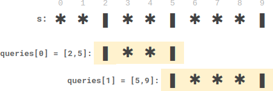

## 2055. Plates Between Candles
🔗  Link: [Plates Between Candles](https://leetcode.com/problems/plates-between-candles/description/) 
💡 Difficulty: Medium 
🛠️ Topics: Array, Prefix sum, Binary Search 

======================================================================================= 
There is a long table with a line of plates and candles arranged on top of it. You are given a `0-indexed `string `s` consisting of characters `'*'` and `'|'` only, where a `'*'` represents a plate and a `'|'` represents a candle.

You are also given a 0-indexed 2D integer array `queries` where `queries[i] = [lefti, righti]` denotes the substring `s[lefti...righti]` (inclusive). For each query, you need to find the number of plates between candles that are in the substring. A plate is considered between candles if there is at least one candle to its left and at least one candle to its right in the substring.

- For example, `s = "||**||**|*"`, and a query `[3, 8]` denotes the substring `"*||**|"`. The number of plates between candles in this substring is `2`, as each of the two plates has at least one candle in the substring to its left and right.
Return an integer array `answer` where `answer[i]` is the answer to the `ith` query.

Example 1: 
 
Input: s = "**|**|***|", queries = [[2,5],[5,9]] 
Output: [2,3] 
Explanation 
- queries[0] has two plates between candles. 
- queries[1] has three plates between candles. 

Example 2: 
Input: s = "***|**|*****|**||**|*", queries = [[1,17],[4,5],[14,17],[5,11],[15,16]] 
Output: [9,0,0,0,0] 
Explanation: 
- queries[0] has nine plates between candles. 
- The other queries have zero plates between candles. 

Constraints: 
- 3 <= s.length <= 10^5
- s consists of '*' and '|' characters.
- 1 <= queries.length <= 10^5
- queries[i].length == 2
- 0 <= lefti <= righti < s.length 

======================================================================================= 
### UMPIRE Method:
#### Understand

> - Ask clarifying questions and use examples to understand what the interviewer wants out of this problem.
> - Choose a “happy path” test input, different than the one provided, and a few edge case inputs. 
> - Verify that you and the interviewer are aligned on the expected inputs and outputs.
1. 
2. Any requirement on time/space complexity? 
    - O(n+q) in time and space complexity

### Match
> - See if this problem matches a problem category (e.g. Strings/Arrays) and strategies or patterns within the category

1. Binary Search  
Binary search is an efficient method for locating an element in a sorted list. We can utilize binary search to find the left and right bounds for the candles

2. Prefix Sum  
The use of prefix sum in this context is crucial for optimizing the solution, especially when dealing with multiple queries, by enabling efficient computation of results without having to recalculate the number of candles or plates from scratch for each query

### Plan
> - Sketch visualizations and write pseudocode
> - Walk through a high level implementation with an existing diagram

- General Idea: compute the number of plates ('*') located between pairs of candles ('|') in a string for given query ranges by utilizing precomputed prefix sums and nearest candle indices. This approach allows for efficient query resolution by leveraging precalculated data to provide quick access to the count of plates between candles for any segment of the string defined by the queries.

1) Initialize Data Structures:
- Determine the length n of the string s.
- Create a prefix_sum list of length n to store the cumulative count of plates ('*') up to each index in s.
- Create candle_left and candle_right lists of length n to store the index of the nearest candle ('|') to the left and right of each index in s, respectively.

2) Precompute Prefix Sum:
- Set the first element of prefix_sum based on whether the first character in s is a plate ('*').
- Set the first element of candle_left based on whether the first character in s is a candle ('|').

3) Precompute Nearest Left Candles:
- Iterate through the string s from index 1 to n-1.
- Update the prefix_sum at each index to the sum of the previous prefix_sum value and 1 if the current character is a plate.
- Update candle_left at each index to the current index if the current character is a candle, otherwise carry forward the nearest left candle index found so far.

4) Precompute Nearest Right Candles:
Set the last element of candle_right based on whether the last character in s is a candle.
- Iterate backwards through the string s from index n-2 to 0.
- Update candle_right at each index to the current index if the current character is a candle, otherwise carry forward the nearest right candle index found so far.

5) Process Queries:
- Initialize a result list of length equal to the number of queries to store the results.
- For each query, determine the nearest right candle index from the starting point and the nearest left candle index from the ending point of the query range.
- If a valid candle is found on both sides (the right candle index is less than the left candle index), calculate the number of plates between these two candles by subtracting the cumulative plate counts at these indices (using prefix_sum).
- If no valid candles enclose the range, set the result for this query to 0.

6) Return Results:
- Return the result list containing the number of plates between candles for each query.

### Implement
> - Implement the solution (make sure to know what level of detail the interviewer wants)

see solution.py

### Review
> - Re-check that your algorithm solves the problem by running through important examples
> - Go through it as if you are debugging it, assuming there is a bug

### Evaluate
> - Finish by giving space and run-time complexity
> - Discuss any pros and cons of the solution

Assume N is the length of the string. Q is the number of queries. 

Time complexity: O(n+q)
Space complexity: O(3n+q) = O(n+q)
