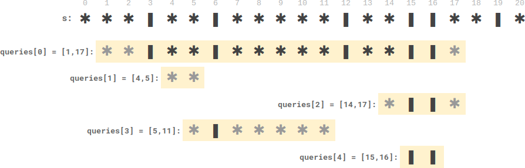

## 2055. Plates Between Candles
🔗  Link: [Plates Between Candles](https://leetcode.com/problems/plates-between-candles/description/) 
💡 Difficulty: Medium 
🛠️ Topics: String, Array, PreSum 

======================================================================================= 

There is a long table with a line of plates and candles arranged on top of it. You are given a 0-indexed string `s` consisting of characters `'*'` and `'|'` only, where a `'*'` represents a plate and a `'|'`represents a candle.

You are also given a 0-indexed 2D integer array `queries` where `queries[i] = [lefti, righti]` denotes the substring `s[lefti...righti]` (inclusive). For each query, you need to find the number of plates between candles that are in the substring. A plate is considered between candles if there is at least one candle to its left and at least one candle to its right in the substring.

For example, `s = "||**||**|*"`, and a `query [3, 8]` denotes the substring `"*||**|"`. The number of plates between candles in this substring is 2, as each of the two plates has at least one candle in the substring to its left and right.
Return an integer array answer where `answer[i]` is the answer to the ith query.

Example 1: 
 
Input: s = `"**|**|***|"`, queries = [[2,5],[5,9]] 
Output: [2,3] 
Explanation: 
- queries[0] has two plates between candles.
- queries[1] has three plates between candles.

Example 2: 
 
Input: s = `"***|**|*****|**||**|*"`, queries = [[1,17],[4,5],[14,17],[5,11],[15,16]] 
Output: [9,0,0,0,0] 
Explanation: 
- queries[0] has nine plates between candles.
- The other queries have zero plates between candles.

Constraints: 
- 3 <= s.length <= 10^5
- s consists of '*' and '|' characters.
- 1 <= queries.length <= 105
- queries[i].length == 2
- 0 <= lefti <= righti < s.length 

======================================================================================= 
### UMPIRE Method:
#### Understand

> - Ask clarifying questions and use examples to understand what the interviewer wants out of this problem.
> - Choose a “happy path” test input, different than the one provided, and a few edge case inputs. 
> - Verify that you and the interviewer are aligned on the expected inputs and outputs.
1.  Any requirement on time/space complexity?
- O(1) in time for query

### Match
> - See if this problem matches a problem category (e.g. Strings/Arrays) and strategies or patterns within the category

- Prefix Sum 
1) The problem involves multiple queries, each asking for information about a specific range within the string. Calculating the number of candles in each range from scratch for every query would be inefficient, especially if the number of queries is large. 
2) The information sought in each query (the number of candles) has a cumulative nature. This means that the total number of candles in a range can be quickly calculated if you know the total number up to a certain point. Prefix sums are perfect for this, as they allow you to compute the total in a range with just two array accesses (one for each end of the range).
3) With prefix sums, the total number of candles in any range can be found in constant time (O(1)) after an initial O(n) setup, where n is the length of the string. This is much faster than recalculating the sum for each query, which would take O(n) time per query.

### Plan
> - Sketch visualizations and write pseudocode
> - Walk through a high level implementation with an existing diagram

General Idea: Precomputes prefix sums and the positions of the nearest candles on both sides of each character in a string to efficiently process multiple queries. Each query calculates the number of plates between candles in a specified substring, utilizing these precomputed values for quick and accurate results.

1) Precomputation Phase:
- Iterate over the string `s` to compute the prefix sum of candles (|). For each position `i, store the total number of candles from the start of the string to position `i`.
- Simultaneously, determine and store the position of the nearest candle to the left of each character in `s`.
- Similarly, determine and store the position of the nearest candle to the right of each character in `s`.

2) Query Processing:
- For each query, which specifies a substring of `s`, find the nearest candles to the left and right within the substring. This is done using the precomputed nearest candle positions.
- Calculate the number of plates (*) between these two candles in the substring. This is achieved by subtracting the number of candles (obtained from the prefix sum) in this range from the total length of the range.
- Store this calculated number in an output array, which forms the answer to each query.

### Implement
> - Implement the solution (make sure to know what level of detail the interviewer wants)

see solution.py

### Review
> - Re-check that your algorithm solves the problem by running through important examples
> - Go through it as if you are debugging it, assuming there is a bug
### Evaluate
> - Finish by giving space and run-time complexity
> - Discuss any pros and cons of the solution

Assume N is the length of the string `s`

- Time Complexity: O(1) for query
- Space Complexity: O(N), primarily due to the space required for the precomputed arrays