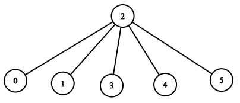

## 1376. Time Needed to Inform All Employees
🔗  Link: [Time Needed to Inform All Employees](https://leetcode.com/problems/time-needed-to-inform-all-employees/description/) 
💡 Difficulty: Medium 
🛠️ Topics: Tree, BFS, DFS 

======================================================================================= 
A company has `n` employees with a unique ID for each employee from `0` to `n - 1`. The head of the company is the one with `headID`.

Each employee has one direct manager given in the manager array where `manager[i]` is the direct manager of the i-th employee, `manager[headID] = -1`. Also, it is guaranteed that the subordination relationships have a **tree** structure.

The head of the company wants to inform all the company employees of an urgent piece of news. He will inform his direct subordinates, and they will inform their subordinates, and so on until all employees know about the urgent news.

The *i-th* employee needs informTime[i] minutes to inform all of his direct subordinates (i.e., After informTime[i] minutes, all his direct subordinates can start spreading the news).

Return the number of minutes needed to inform all the employees about the urgent news.

 

Example 1: 
Input: n = 1, headID = 0, manager = [-1], informTime = [0] 
Output: 0 
Explanation: The head of the company is the only employee in the company. 

Example 2: 
 
Input: n = 6, headID = 2, manager = [2,2,-1,2,2,2], informTime = [0,0,1,0,0,0] 
Output: 1 
Explanation: The head of the company with id = 2 is the direct manager of all the employees in the company and needs 1 minute to inform them all.
The tree structure of the employees in the company is shown. 

Constraints: 
- 1 <= n <= 10^5
- 0 <= headID < n
- manager.length == n
- 0 <= manager[i] < n
- manager[headID] == -1
- informTime.length == n
- 0 <= informTime[i] <= 1000
- informTime[i] == 0 if employee i has no subordinates.
- It is guaranteed that all the employees can be informed.
======================================================================================= 
### UMPIRE Method:
#### Understand

> - Ask clarifying questions and use examples to understand what the interviewer wants out of this problem.
> - Choose a “happy path” test input, different than the one provided, and a few edge case inputs. 
> - Verify that you and the interviewer are aligned on the expected inputs and outputs.
1. Can we transform the organization into a tree with each node containing the wait time (before transmitting down to their reports)?
- This can simplify the problem into traversing the tree from the top node down to the bottom.
2. Any requirement on time/space complexity?
    - Time and Space are both required to be O(N) 
3. How can we represent the company?
- The company can be represented as a tree, `headID` is always the `root`. You can store for each node the time needed to be informed of the news. Answer is the max time a leaf node needs to be informed.

### Match
> - See if this problem matches a problem category (e.g. Strings/Arrays) and strategies or patterns within the category

For graph problems, we want to consider the following approaches: 

1) Is this a directed or undirected graph? Directed graph. Direction from manager to employee or employee to manager?
2) Is this BFS or DFS? Similar to root to leaf path. Can be done through DFS
Adjacency List: We can use an adjacency list to store the graph, especially since the graph is sparse.
3) Adjacency Matrix: We can use an adjacency matrix to store the graph, but a sparse graph will cause an unneeded worst-case runtime.
4) Topological Sort: We can use topological sort for the same reason we can use DFS, as in this problem, the application of DFS is a topological sort.
5) Union Find: Are there find and union operations here? Can you perform a find operation where you can determine which subset a particular element is in? This can be used for determining if two elements are in the same subset. Can you perform a union operation where you join two subsets into a single subset? Can you check if the two subsets belong to same set? If no, then we cannot perform union.

### Plan
> - Sketch visualizations and write pseudocode
> - Walk through a high level implementation with an existing diagram

General Idea: 
- Representation of the Company Structure: The company's hierarchical structure is represented as a tree using a mapping (a dictionary) from managers to their list of direct reports (subordinates). This structure allows for an efficient traversal from the head of the company downwards.

- Breadth-First Search (BFS): The algorithm employs a Breadth-First Search approach to traverse the company structure. Starting from the head of the company, it systematically goes through each employee level by level, calculating the time it takes for each employee to be informed and then passing the message along to their direct reports.

### Implement
> - Implement the solution (make sure to know what level of detail the interviewer wants)

see solution.py

### Review
> - Re-check that your algorithm solves the problem by running through important examples
> - Go through it as if you are debugging it, assuming there is a bug
### Evaluate
> - Finish by giving space and run-time complexity
> - Discuss any pros and cons of the solution

Assume N represents the total number of employees in the company.

- Time Complexity: O(N)
- Space Complexity: O(N)
