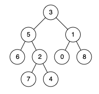

## 1676. Lowest Common Ancestor of a Binary Tree IV
🔗  Link: [Lowest Common Ancestor of a Binary Tree IV](https://leetcode.com/problems/lowest-common-ancestor-of-a-binary-tree-iv/description/?envType=study-plan-v2&envId=amazon-spring-23-high-frequency) 
💡 Difficulty: Medium 
🛠️ Topics: Tree, BFS, DFS 

======================================================================================= 
Given the `root` of a binary tree and an array of `TreeNode` objects `nodes`, return the lowest common ancestor (LCA) of all the nodes in `nodes`. All the nodes will exist in the tree, and all values of the tree's nodes are unique. 

Extending the definition of LCA on Wikipedia: "The lowest common ancestor of n nodes p1, p2, ..., pn in a binary tree T is the lowest node that has every pi as a descendant (where we allow a node to be a descendant of itself) for every valid i". A descendant of a node x is a node y that is on the path from node x to some leaf node. 

Example 1: 
 
Input: root = [3,5,1,6,2,0,8,null,null,7,4], nodes = [4,7] 
Output: 2 
Explanation: The lowest common ancestor of nodes 4 and 7 is node 2. 

Example 2: 
 
Input: root = [3,5,1,6,2,0,8,null,null,7,4], nodes = [1] 
Output: 1 
Explanation: The lowest common ancestor of a single node is the node itself. 

Example 3: 
 
Input: root = [3,5,1,6,2,0,8,null,null,7,4], nodes = [7,6,2,4] 
Output: 5 
Explanation: The lowest common ancestor of the nodes 7, 6, 2, and 4 is node 5. 

Constraints: 
- The number of nodes in the tree is in the range `[1, 10^4]`
- `-10^9 <= Node.val <= 10^9`
- All `Node.val` are unique
- All `nodes[i]` will exist in the tree
- All `nodes[i]` are distinct
======================================================================================= 
### UMPIRE Method:
#### Understand

> - Ask clarifying questions and use examples to understand what the interviewer wants out of this problem.
> - Choose a “happy path” test input, different than the one provided, and a few edge case inputs. 
> - Verify that you and the interviewer are aligned on the expected inputs and outputs.
1. Are all values in tree unique?
    - all values in the tree are unique
2. Any requirement on time/space complexity?
    - Time is O(N) and Space is O(1) excluding the recursion stack

### Match
> - See if this problem matches a problem category (e.g. Strings/Arrays) and strategies or patterns within the category

1. Tree 
Choosing a specific tree traversal helps identify a existant node.

### Plan
> - Sketch visualizations and write pseudocode
> - Walk through a high level implementation with an existing diagram

General Idea: uses depth-first search (DFS) to traverse the tree and determines the LCA based on whether the current node is in the target nodes list or is a common ancestor of two nodes from the list

1. Define DFS function
    - If the `node` is `None` (base case for recursion), return `None`
    - If the current `node` is in the `nodes` set, return the `node` as it is one of the target
2. Traversing the tree
    - Recursively call dfs for the left child of the current node and store the result in left
    - Similarly, call dfs for the right child and store the result in right
3. Identifying the Lowest Common Ancestor
    - If both `left` and `right` are not `None`, it means the current `node` is the lowest common ancestor of two nodes from the list, so return the current `node`
    - If only one of `left` or `right` is not `None`, return that non-None node (either `left` or `right`), as it indicates the path towards a target node or the target node itself

### Implement
> - Implement the solution (make sure to know what level of detail the interviewer wants)

see solution.py

### Review
> - Re-check that your algorithm solves the problem by running through important examples
> - Go through it as if you are debugging it, assuming there is a bug
### Evaluate
> - Finish by giving space and run-time complexity
> - Discuss any pros and cons of the solution

Assume N represents the number nodes in tree.

- Time Complexity: O(N)
- Space Complexity: O(1), at most size = 26
