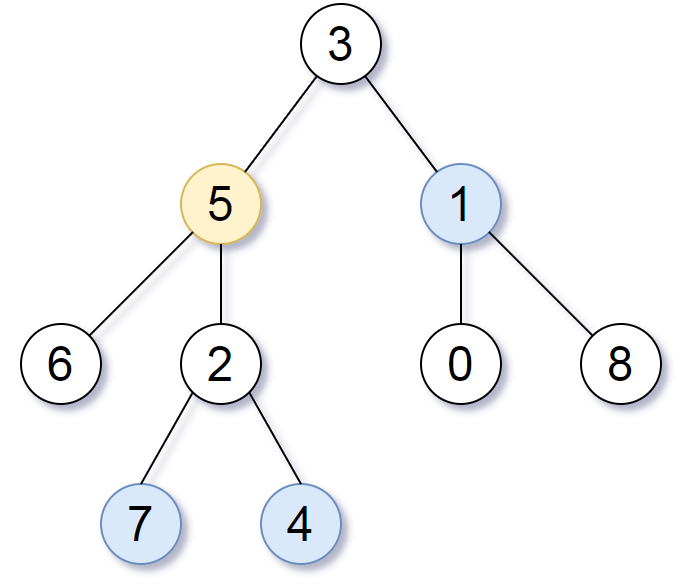

## 863. All Nodes Distance K in Binary Tree
🔗  Link: [All Nodes Distance K in Binary Tree](https://leetcode.com/problems/all-nodes-distance-k-in-binary-tree/description/) 
💡 Difficulty: Medium 
🛠️ Topics: Tree, BFS, DFS 

======================================================================================= 
Given the `root` of a binary tree, the value of a `target` node target, and an integer `k`, return an array of the values of all nodes that have a distance `k` from the target node.

You can return the answer in **any order**. 

Example 1: 
 
Input: [3,5,1,6,2,0,8,null,null,7,4], target = 5, k = 2
Output: [7,4,1] 
Explanation: The nodes that are a distance 2 from the target node (with value 5) have values 7, 4, and 1. 

Example 2: 
Input: root = [1], target = 1, k = 3 
Output: [] 

Constraints: 
- The number of nodes in the tree is in the range [1, 500]
- 0 <= Node.val <= 500
- All the values Node.val are unique
- target is the value of one of the nodes in the tree
- 0 <= k <= 1000
======================================================================================= 
### UMPIRE Method:
#### Understand

> - Ask clarifying questions and use examples to understand what the interviewer wants out of this problem.
> - Choose a “happy path” test input, different than the one provided, and a few edge case inputs. 
> - Verify that you and the interviewer are aligned on the expected inputs and outputs.
1. Are all values in tree unique?
    - all values in the tree are unique
2. Any requirement on time/space complexity?
    - O(N) Time and O(N) Space
3. Can the input tree be Null?
    - No, there will at least be one node

### Match
> - See if this problem matches a problem category (e.g. Strings/Arrays) and strategies or patterns within the category

1. Graph Representation of a Tree
- First transforms the tree into a graph representation where **each node points to its children and its parent**, effectively making it an undirected graph. This is crucial for allowing **bidirectional traversal**, which is not inherently possible in a tree structure since trees are typically navigated in a top-down manner. This is particularly useful when you need to move both up (towards the parent) and down (towards the children) from any given node

2. Depth-First Search (DFS) for *Graph Building*: 
- The `build_graph` helper function uses DFS to traverse the tree and build the graph representation. DFS is a common technique for exploring all the nodes and edges in a graph or tree, ensuring that each connection (including parent-child and child-parent links) is represented

3. Breadth-First Search (BFS) for *Level Traversal*: 
- Once the graph is built, we use BFS starting from the target node to find all nodes that are k distance away. BFS is employed here because it explores neighbors of all nodes at the current depth before moving on to the nodes at the next depth level, making it ideal for level-by-level traversal to find nodes exactly k steps away

4. Queue for BFS Implementation: 
- The algorithm uses a queue to keep track of nodes to visit and their corresponding distance from the target node. Queues are a fundamental component for implementing BFS, allowing the algorithm to process nodes in a first-in, first-out (FIFO) order

5. Set for Tracking Visited Nodes: 
- A set named seen is used to track visited nodes to prevent revisiting and thus avoid infinite loops. This is a common pattern in graph traversal problems to ensure each node is processed exactly once

### Plan
> - Sketch visualizations and write pseudocode
> - Walk through a high level implementation with an existing diagram

General Idea: 

### Implement
> - Implement the solution (make sure to know what level of detail the interviewer wants)

see solution.py

### Review
> - Re-check that your algorithm solves the problem by running through important examples
> - Go through it as if you are debugging it, assuming there is a bug
### Evaluate
> - Finish by giving space and run-time complexity
> - Discuss any pros and cons of the solution

Assume N represents the number nodes in tree.

- Time Complexity: O(N)
- Space Complexity: O(1), at most size = 26
