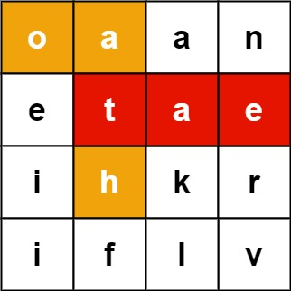

## 212. Word Search II - to be solved
🔗  Link: [Word Search II](https://leetcode.com/problems/word-search-ii/description/) 
💡 Difficulty: Hard 
🛠️ Topics: Array, Backtracking, Trie 

======================================================================================= 
Given an `m x n` `board` of characters and a list of strings `words`, return all words on the board. 

Each word must be constructed from letters of sequentially adjacent cells, where adjacent cells are horizontally or vertically neighboring. The same letter cell may not be used more than once in a word. 

Example 1: 
 
Input: board = [["o","a","a","n"], 
                ["e","t","a","e"], 
                ["i","h","k","r"], 
                ["i","f","l","v"]], 
                words = ["oath","pea","eat","rain"] 
Output: ["eat","oath"] 

Example 2: 
Input: board = [["a","b"], 
                ["c","d"]], 
                words = ["abcb"] 
Output: [] 

Constraints: 
- m == board.length
- n == board[i].length
- 1 <= m, n <= 12
- board[i][j] is a lowercase English letter.
- 1 <= words.length <= 3 * 10^4
- 1 <= words[i].length <= 10
- words[i] consists of lowercase English letters.
- All the strings of words are unique.

======================================================================================= 
### UMPIRE Method:
#### Understand

> - Ask clarifying questions and use examples to understand what the interviewer wants out of this problem.
> - Choose a “happy path” test input, different than the one provided, and a few edge case inputs. 
> - Verify that you and the interviewer are aligned on the expected inputs and outputs.
1. Can the input `board` or `word` be empty? 
    - the smallest `board` would be 1 row and 1 column ; the shortest `word` would be 1 character long
2. Any requirement on time/space complexity?
3. What if we come across the same letter during the search path?
    - During the search path, set the visited letter as visited to avoid reuse
4. Is it possible that the word is longer than then number of possible squares in 2D-Array?
    - Yes

### Match
> - See if this problem matches a problem category (e.g. Strings/Arrays) and strategies or patterns within the category

1. Backtracking  
Backtracking is a general algorithm for finding all (or some) solutions to some computational problems, notably constraint satisfaction problems, that incrementally builds candidates to the solutions and abandons a candidate ("backtracks") as soon as it determines that the candidate cannot possibly be completed to a valid solution.

### Plan
> - Sketch visualizations and write pseudocode
> - Walk through a high level implementation with an existing diagram

General Idea: .... to be solved

### Implement
> - Implement the solution (make sure to know what level of detail the interviewer wants)

see solution.py

### Review
> - Re-check that your algorithm solves the problem by running through important examples
> - Go through it as if you are debugging it, assuming there is a bug
### Evaluate
> - Finish by giving space and run-time complexity
> - Discuss any pros and cons of the solution
<!-- 
- Assume N represents the number of rows in 2D-array 
- Assume M represents the number of columns in 2D-array
- Assume L represents the number of characters in the word -->

- Time Complexity: 
- Space Complexity: 