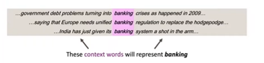
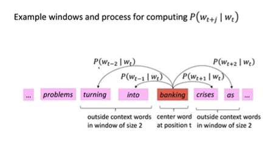
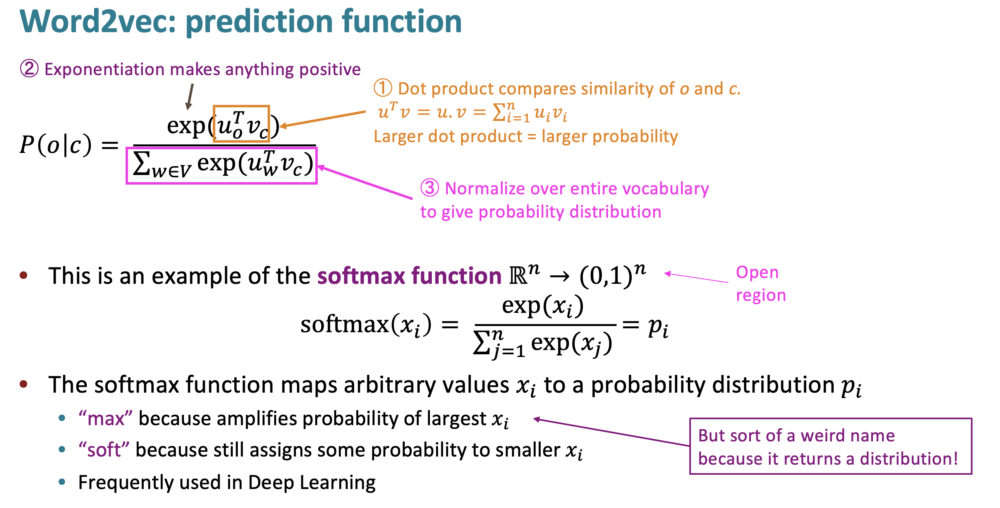
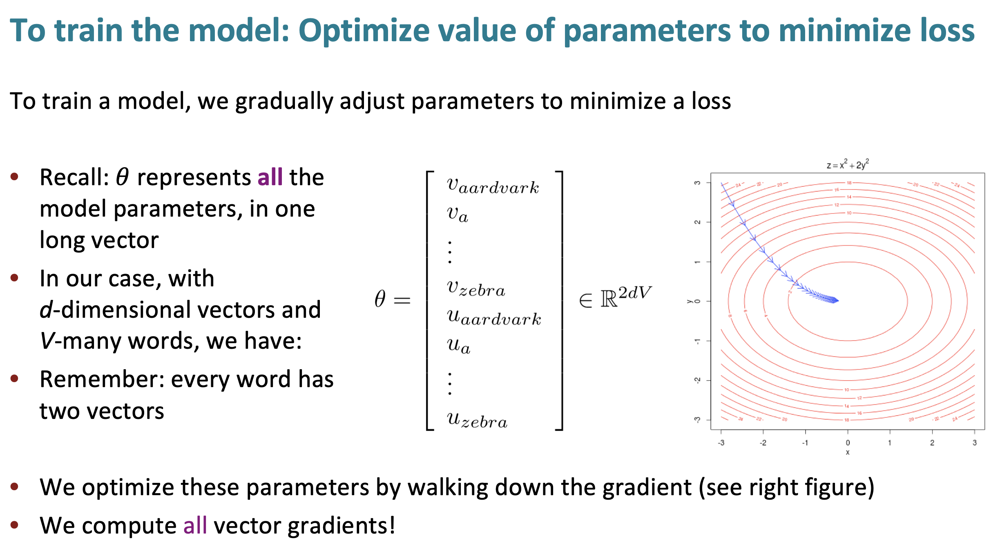
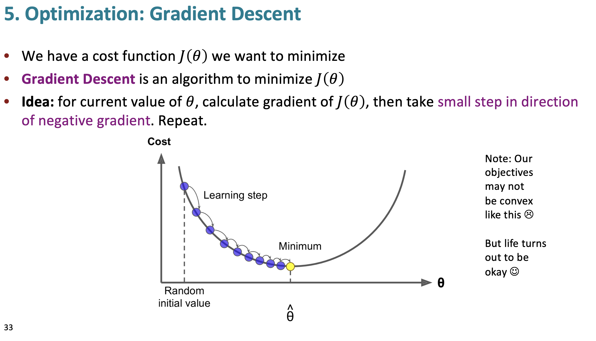

### Course Introduction
- https://youtu.be/rmVRLeJRkl4?si=UGZcRJ9rUpjz6BrU
- **Instructor and Course Overview**: Christopher Manning introduces Stanford CS224n, focusing on Natural Language Processing (NLP) with deep learning. The class covers NLP basics, the application of deep learning methods, and the creation of NLP systems using PyTorch.
- **Lecture Focus**: The first lecture aims to provide an understanding of human language, word meaning, and the Word2Vec algorithm. Key concepts include calculating gradients for objective functions, basic optimization, and understanding the effectiveness of deep learning in representing word meanings.

### Introduction to Human Language and Word Meaning
- Human language is a social construct, constantly evolving as people adapt its usage. This adaptability makes language an excellent tool for human communication but a challenging system for computers to understand.
- An example from an XKCD cartoon is used to illustrate how language carries numerous signals, contexts, and subtexts, which are interpreted differently by each person. Language is not a formal system but "glorious chaos."

### The Evolutionary Role of Language
- **Importance of Language**: Language, a relatively recent development in the timeline of human evolution, was a crucial tool that set humans apart from other species. The ability to communicate effectively was more powerful than physical traits like speed or strength.
- **Writing and Knowledge Preservation**: The development of writing allowed humans to preserve and share knowledge across distances and generations, significantly advancing human progress from the Bronze Age to modern technology.

### Deep Learning and NLP: The Current State
- Recent advancements in NLP, such as machine translation, have enabled moderately accurate translations, showcasing the progress made by AI in understanding language.
- **GPT-3**: One of the most notable advancements in NLP, GPT-3 by OpenAI, is highlighted as a step toward universal models that can perform various tasks, from generating text to translating human language to SQL.

### Representing Word Meaning in NLP
- **Traditional Approaches**: Traditionally, word meaning was represented using resources like dictionaries and thesauri (e.g., WordNet). However, these methods have limitations, such as a lack of nuance, outdated terminology, and the inability to capture similarity between non-synonymous but semantically related words.
- **Problem with Discrete Representations**: Traditional NLP models treat words as discrete symbols (one-hot vectors), which fails to capture relationships or similarities between words. For example, "motel" and "hotel" are represented as entirely unrelated symbols.

### Introduction to Word Vectors (Word Embeddings)
- **Distributional Semantics**: Instead of relying on static word definitions, deep learning models use distributional semantics, which defines a word's meaning by the words that frequently appear near it in text. This idea, summarized by J.R. Firth as "You shall know a word by the company it keeps," allows for a more dynamic and context-based understanding of meaning.

- **Word2Vec Algorithm**: Introduced by Tomas Mikolov and colleagues in 2013, Word2Vec is a popular method for learning word vectors. The algorithm uses a large corpus of text to learn dense, real-valued vectors that represent words. These vectors capture semantic meaning by predicting the probability of context words given a center word.
    - **Basic idea**:   
        - We have a large corpus (“body”) of text
        - Every word in a fixed vocabulary is represented by a vector
        - Go through each position t in the text, which has a center word c and context (“outside”) words o
        - Use the similarity of the word vectors for c and o to calculate the probability of o given c (or vice versa)
        - Keep adjusting the word vectors to maximize this probability 
        

### Building Word Vectors with Word2Vec
- **Objective**: The goal is to adjust word vectors to maximize the probability of the actual context words given a center word. This is done through optimization techniques like gradient descent.
- **Softmax Function**: The softmax function is used to convert raw scores (dot products between word vectors) into probabilities. The objective function is the negative log likelihood of these probabilities, which is minimized using gradient-based optimization.
 
 

### Key Observations with Word Embeddings
- **Semantic Clusters**: When visualizing word embeddings in a 2D space, semantically similar words cluster together (e.g., countries, verbs, and nationalities), showing the effectiveness of the distributional approach in capturing meaning.
- **Analogy Tasks**: Word vectors can perform arithmetic-like operations to solve analogies. For example, "King - Man + Woman = Queen." This demonstrates that word vectors capture not only semantic similarity but also certain relational structures.

### Challenges and Limitations of Word Embeddings
- **Handling Multiple Meanings**: Words with multiple meanings (e.g., "star" as an astronomical object and a celebrity) are challenging to represent with a single vector. While the current approach collapses all meanings into one vector, further methods to distinguish meanings are explored in subsequent lectures.
- **Antonym Problem**: Opposites often appear in similar contexts (e.g., "good" and "bad"), resulting in similar word vectors, which is not always desirable for tasks that require distinguishing between such words.
- **Function Words**: Common function words like "and," "not," and "so" have similar vectors because they appear in many contexts, making it challenging to capture their subtle distinctions.