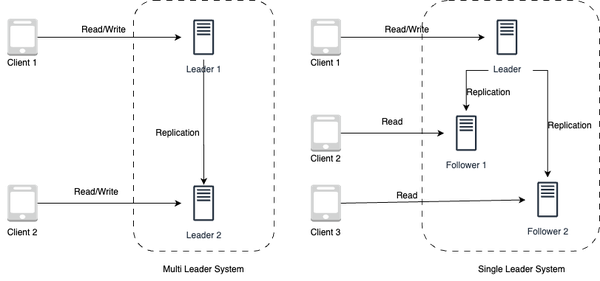
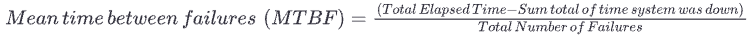
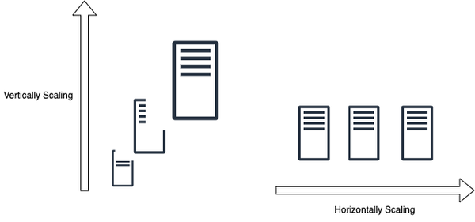
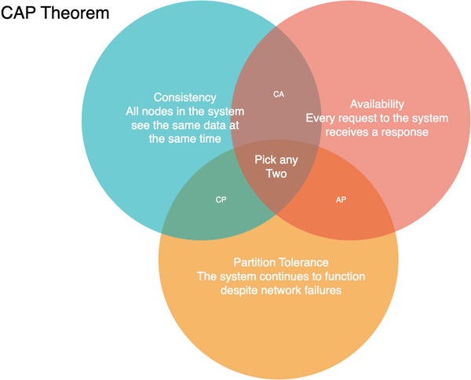
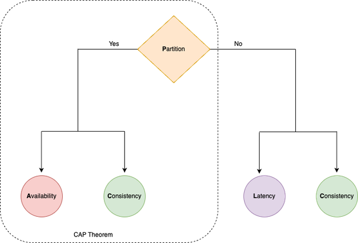

# Content
- 7 System Design Concepts
- 8 Fallacies of Distributed Computing
- System Design Trade-offs
- System Design Guidelines

## 7 System Design Concepts
### 1.  Communication
- A large scale software system is composed of small sub-systems, known as servers, which communicate with each other. Communication can take place in either a synchronous or asynchronous fashion:

    - Synchronous Communication: In system design, a communication mechanism is synchronous when the receiver will block (or wait) for the call or execution to return before continuing, which could be perceived by the user as latency or performance lag in the application. 
    - Asynchronous Communication: A communication mechanism is asynchronous when the sender does not block (or wait) for the call or execution to return from the receiver. Execution continues on in your program or system, and when the call returns from the receiving server, a “callback” function is executed.  E.g. Messaging platforms, forums, and social media, where users can post messages and responses may not be immediate.
### 2. Consistency
- Consistency can refer to a variety of concepts and contexts in system design.
    
    - Consistency in **Distributed Systems**:
        
        - Data replication: Multiple copies of the data are maintained on different replica nodes, and updates to the data are made on all replica nodes simultaneously through blocking synchronous communication.
        - Consensus protocols: Ensure that all replica nodes agree on the updates to be made to the data. They can use a variety of mechanisms, such as voting or leader election, to ensure that all replica nodes are in agreement before updating the data.
        - Conflict resolution: In the event that two or more replica nodes try to update the same data simultaneously, conflict resolution algorithms are used to determine which update should be applied. These algorithms can use various strategies, such as last writer wins or merge algorithms, to resolve conflicts.

    - Consistency in **Data Storage and Retrieval**:

        - Write-ahead logging: Writes to the data are first recorded in a log before they are applied to the actual data. This ensures that if the system crashes or fails, the data can be restored to a consistent state by replaying the log.
        - Locking: Ensures that multiple writes do not interfere with each other and that reads always return the value of the most recent write.
        - Data versioning: Each write operation is assigned a version number, and reads always return the value of the most recent version. This allows for multiple writes to be performed concurrently, while still ensuring that reads return the value of the most recent write.

- Consistency Spectrum Model:
    - Strong Consistency: Ensures all replica nodes have the exact same view of data at all times, with updates immediately reflected across all nodes. This offers the highest level of data accuracy but requires constant communication between nodes, making it challenging to achieve.
    - Monotonic read consistency: Guarantees that once a client reads a value, all subsequent reads will return the same or a newer value, preventing clients from seeing outdated data.
    - Monotonic write consistency: Ensures that once a write is acknowledged, subsequent reads from that replica node will always return the updated value, preventing outdated data from being returned after a write.
    - Causal consistency: Preserves the order of causally related operations, ensuring that dependent operations appear in the correct order across all processes, offering a stronger consistency than eventual consistency.
    - Eventual Consistency: Guarantees that all replica nodes will eventually converge to the same state, allowing for temporary inconsistencies but providing flexibility and tolerance for delays or failures. 
    

### 3. Availability
-  A system that is highly available is able to process requests and return responses in a timely manner, even under heavy load or in the face of failures or errors.
- Availability can be measured mathematically: 

- Availability percentages are represented in 9s, based on the above formula over a period of time. 

- Achieving higher levels of availability becomes progressively more challenging and resource-intensive. Each additional nine requires an exponential increase in redundancy, fault-tolerant architecture, and rigorous maintenance practices. It often involves implementing redundant components, backup systems, load balancing, failover mechanisms, and continuous monitoring to minimize downtime and ensure rapid recovery in case of failures.
- The availability of a system that consists of multiple sub-systems depends on whether the components are arranged in **sequence** or **in parallel** with respect to serving the request.

    - If the components are in sequence, the overall availability of the service will be the product of the availability of each component. 
    - If the components are in parallel, the overall availability of the service will be the sum of the availability of each component minus the product of their unavailability. This can lead to significantly higher availability compared to the same components arranged in sequence.
- Availability Patterns

    - Failover Patterns: Failover refers to the process of switching to a redundant or backup system in the event of a failure or error in the primary system. There are two main types of failover patterns:

        - Active-active failover: Multiple systems are used in parallel, and all systems are actively processing requests. If one system fails, the remaining systems can continue to process requests and maintain high availability.
        - Active-passive failover: One system is designated as the primary system and actively processes requests, while one or more backup systems are maintained in a passive state. If the primary system fails, the backup system is activated to take over processing of requests.
    
            - The failover pattern can involve the use of additional hardware and can add complexity to the system. There is also the potential for data loss if the active system fails before newly written data can be replicated to the passive system.

    - Replication Patterns: Replication is the process of maintaining multiple copies of data or other resources in order to improve availability and fault tolerance. There are two main types of replication patterns:

        - Multi leader replication: Multiple nodes can read and write data simultaneously, improving flexibility and resource utilization. However, it requires load balancing or application logic to manage writes across leaders. The system is often loosely consistent or experiences increased write latency due to synchronization. Conflict resolution becomes more complex as more leaders are added.

        - Single leader replication: A designated leader handles all writes while followers replicate data for read-only operations. This simpler approach is easier to manage but risks reduced availability if the leader fails, as only the leader can handle updates, potentially leading to data loss during outages.

            - There is a risk of data loss if the leader system fails before newly written data can be replicated to other nodes. And thus, the more read replicas that are used, the more writes need to be replicated, which can lead to greater replication lag. In addition, the use of read replicas can impact the performance of the system, as they may be bogged down with replaying writes and unable to process as many reads. Furthermore, replication can involve the use of additional hardware and can add complexity to the system. Finally, some systems may have more efficient write performance on the leader system, as it can spawn multiple threads to write in parallel, while read replicas may only support writing sequentially with a single thread.
             

### 4. Reliability
- Reliability refers to the ability of a system or component to perform its intended function consistently and without failure over a given period of time.
- Reliability is typically expressed as a probability or percentage of time that the system will operate without failure. 
-  One way to measure the reliability of a system is through the use of mean time between failures(MTBF) and mean time to repair (MTTR).
    - 
    - 
    - Together, MTBF and MTTR can be used to understand the overall reliability of a system. For example, a system with a high MTBF and a low MTTR is considered to be more reliable than a system with a low MTBF and a high MTTR, as it is less likely to experience failures and can be restored to operation more quickly when failures do occur.

### 5. Scalability
- Scalability in system design refers to a system’s ability to handle increased load or demand by adding resources, such as more request workload or data storage workload, without compromising performance.
- To ensure scalability, there are two major complementary patterns to scale the system: 
    - **Vertical Scaling**: involves meeting the load requirements of the system by increasing the capacity of a single server. 
        - Pros:
            - Increases capacity of a single server by upgrading resources (CPU, RAM, GPU, storage, etc.).
            - Useful for handling predictable traffic and existing demand efficiently.
        - Cons:
            - Limited by the maximum configuration capacity of a single server.
            - High cost due to expensive upgrades required for high-end configurations.

    - **Horizontal Scaling**:involves meeting the load requirements of the system by increasing the number of the servers.
        - Pros:
            - Increases capacity by adding more servers, making it effective for handling unpredictable traffic.
            - Cost-effective as more servers can be added as demand grows, providing a better dollar cost proposition for scaling.
        - Cons:
            - Increased complexity in managing multiple servers and ensuring they work together seamlessly.
            - Requires additional efforts to maintain and configure servers to function as a unified system.

### 6. Maintainability
- Maintainability is the ability of the system to be modified, adapted, or extended to meet the changing needs of its users while ensuring smooth system operations.
- The maintainability of a system requires covering these three underlyings aspects of the system:

    - *Operability*: This requires the system to operate smoothly under normal conditions and even return back to normal operations within stipulated time after a fault.
    - *Lucidity*: This requires the system to be simple and lucid to understand, extend to add features and even, fix bugs. 
    - *Modifiability*: This requires the system to be built in a modular way to allow it to be modified and extended easily, without disrupting the functionality of other subsystems.
### 7. Fault Tolerance
- Large scale systems generally employ a large number of servers and storage devices to handle and respond to the user requests and store data. Fault tolerance requires the system to recover from any failure (either hardware or software failure) and continue to serve the requests. 
- Fault tolerance needs to be supported at hardware as well as software levels, while ensuring the data safety. There are two major mechanisms to ensure data safety: 
    - *Replication*: Replication based fault tolerance ensures data safety as well as serving the request by replicating both the service through multiple replica servers and also, replicating the data through multiple copies of data across multiple storage servers. During a failure, the failed node gets swapped with a fully functioning replica node.
    - *Checkpointing*: Checkpointing based fault tolerance ensures that data is reliably stored and backed up, even after the initial processing is completed. It allows for a system to recover from any potential data loss, as it can restore a previous system state and prevent data loss. It can be done in either using *synchronous* or *asynchronous* mechanisms.

## 8 Fallacies of Distributed Computing
1. Reliable Network 
Networks are complex, dynamic and often, unpredictable. Small issues like switch or power failures can even bring the entire network of a data-center down, making the network unreliable. Thus, it is important to account for the potential of an unreliable network while designing large scale systems, ensuring network fault tolerance from the start.
2. Zero Latency 
The fallacy of “Latency is zero” overlooks that latency is inevitable, limited by the speed of light. Systems should mitigate latency by positioning clients closer to data through **edge computing**, **selecting geographically appropriate data centers**, and **optimizing traffic routing**.
3. Infinite Bandwidth 
The fallacy of “Bandwidth is infinite” ignores that high data volumes can cause network congestion, delays, and bottlenecks. To manage finite bandwidth, systems should use lightweight data formats and techniques like multiplexing to optimize bandwidth utilization and minimize congestion.
4. Secure Network 
There are multiple ways a network can be compromised (ranging from software bugs, OS vulnerabilities, viruses and malwares, cross-site scripting, unencrypted communication, malicious middle actors etc). Hence to account for insecure networks, build systems with a security first mindset and perform defense testing and threat modelling of the built system
5. Fixed Topology 
In distributed systems, the topology changes continuously, because of node failures or node additions. The underlying topology must be abstracted out and the system must be built oblivious to the underlying topology and tolerant to its changes.
6. Single Administrator 
Multiple systems have separate OS, separate teams working on it and hence, multiple administrators. To account for this, the system should be built in a decoupled manner, ensuring repair and troubleshooting becomes easy and distributed too
7. Zero Transport cost 
Network infrastructure has costs, including the cost of network servers, switches, routers, other hardwares, the operating software of these hardware, and the team cost to keep it running smoothly. 
8. Homogenous Network 
Assuming “The network is homogeneous” overlooks the diverse configurations, devices, and protocols involved in a network. To avoid this pitfall, design systems with interoperability in mind, ensuring subsystems can communicate and function together despite these differences.

The [AWS Well-Architected Framework](https://aws.amazon.com/architecture/well-architected/?nc1=h_ls&wa-lens-whitepapers.sort-by=item.additionalFields.sortDate&wa-lens-whitepapers.sort-order=desc&wa-guidance-whitepapers.sort-by=item.additionalFields.sortDate&wa-guidance-whitepapers.sort-order=desc) consists of six core pillars that provide guidance and best practices for designing and building systems on the AWS cloud, avoiding these fallacies and pitfalls. 

## System Design Trade-offs
- In addition to cost and scalability, other trade-offs must be taken into account when designing a system. Performance, security, maintainability, and usability are all important considerations that must be weighed when designing a system.
- **Time vs Space**
- **Latency vs Throughput**
    - Latency measures how long the packets take to reach the destination in a network.
    - Throughput measures how many packets are processed within a specified period of time.
        - The more the latency the more they would get queued up in the network, reducing the number of packets that are being processed.
- **Performance vs Scalability**
- **Consistency vs Availability**
    - CAP Theorem: It is impossible for a distributed system to simultaneously provide all three of the following guarantees: consistency (C), availability (A), and partition tolerance (P).
         
        - In fact, the choice is really between consistency and availability only when a network partition or failure happens; at all other times, the trade-off has to be made based on the PACELC theorem.
    - PACELC Theorem: In the case of network partitioning (P) in a distributed computer system, one has to choose between availability (A) and consistency (C) (as per the CAP theorem), but else (E), even when the system is running normally in the absence of partitions, one has to choose between latency (L) and consistency (C).
     

## System Design Guidelines
1. Guideline of Isolation: Build It Modularly
2. Guideline of Simplicity: Keep it Simple, Silly
3. Guideline of Performance: Metrics Don’t Lie
4. Guideline of Tradeoffs: There Is No Such Thing As A Free Lunch
5. Guideline of Use Cases: It Always Depends 

