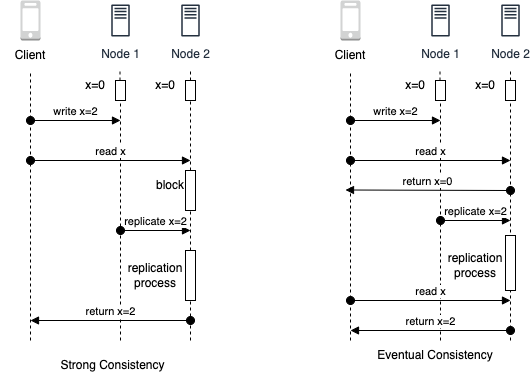
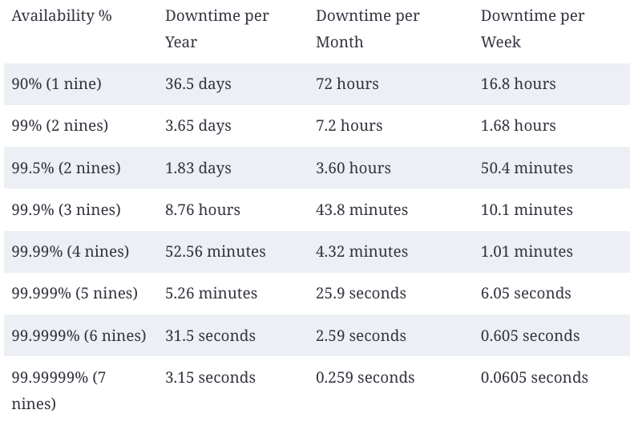

# Content
- System Design Concepts

## System Design Concepts
### 1.  Communication
- A large scale software system is composed of small sub-systems, known as servers, which communicate with each other. Communication can take place in either a synchronous or asynchronous fashion:

    - Synchronous Communication: In system design, a communication mechanism is synchronous when the receiver will block (or wait) for the call or execution to return before continuing, which could be perceived by the user as latency or performance lag in the application. 
    - Asynchronous Communication: A communication mechanism is asynchronous when the sender does not block (or wait) for the call or execution to return from the receiver. Execution continues on in your program or system, and when the call returns from the receiving server, a “callback” function is executed.  E.g. Messaging platforms, forums, and social media, where users can post messages and responses may not be immediate.
### 2. Consistency
- Consistency can refer to a variety of concepts and contexts in system design.
    
    - Consistency in **Distributed Systems**:
        
        - Data replication: Multiple copies of the data are maintained on different replica nodes, and updates to the data are made on all replica nodes simultaneously through blocking synchronous communication.
        - Consensus protocols: Ensure that all replica nodes agree on the updates to be made to the data. They can use a variety of mechanisms, such as voting or leader election, to ensure that all replica nodes are in agreement before updating the data.
        - Conflict resolution: In the event that two or more replica nodes try to update the same data simultaneously, conflict resolution algorithms are used to determine which update should be applied. These algorithms can use various strategies, such as last writer wins or merge algorithms, to resolve conflicts.

    - Consistency in **Data Storage and Retrieval**:

        - Write-ahead logging: Writes to the data are first recorded in a log before they are applied to the actual data. This ensures that if the system crashes or fails, the data can be restored to a consistent state by replaying the log.
        - Locking: Ensures that multiple writes do not interfere with each other and that reads always return the value of the most recent write.
        - Data versioning: Each write operation is assigned a version number, and reads always return the value of the most recent version. This allows for multiple writes to be performed concurrently, while still ensuring that reads return the value of the most recent write.

- Consistency Spectrum Model:
    - Strong Consistency: Ensures all replica nodes have the exact same view of data at all times, with updates immediately reflected across all nodes. This offers the highest level of data accuracy but requires constant communication between nodes, making it challenging to achieve.
    - Monotonic read consistency: Guarantees that once a client reads a value, all subsequent reads will return the same or a newer value, preventing clients from seeing outdated data.
    - Monotonic write consistency: Ensures that once a write is acknowledged, subsequent reads from that replica node will always return the updated value, preventing outdated data from being returned after a write.
    - Causal consistency: Preserves the order of causally related operations, ensuring that dependent operations appear in the correct order across all processes, offering a stronger consistency than eventual consistency.
    - Eventual Consistency: Guarantees that all replica nodes will eventually converge to the same state, allowing for temporary inconsistencies but providing flexibility and tolerance for delays or failures. 
    

### 3. Availability
-  A system that is highly available is able to process requests and return responses in a timely manner, even under heavy load or in the face of failures or errors.
- Availability can be measured mathematically: 

- Availability percentages are represented in 9s, based on the above formula over a period of time. 

- Achieving higher levels of availability becomes progressively more challenging and resource-intensive. Each additional nine requires an exponential increase in redundancy, fault-tolerant architecture, and rigorous maintenance practices. It often involves implementing redundant components, backup systems, load balancing, failover mechanisms, and continuous monitoring to minimize downtime and ensure rapid recovery in case of failures.
- The availability of a system that consists of multiple sub-systems depends on whether the components are arranged in **sequence** or **in parallel** with respect to serving the request.

    - If the components are in sequence, the overall availability of the service will be the product of the availability of each component. 
    - If the components are in parallel, the overall availability of the service will be the sum of the availability of each component minus the product of their unavailability. This can lead to significantly higher availability compared to the same components arranged in sequence.
- Availability Patterns

    - Failover Patterns: Failover refers to the process of switching to a redundant or backup system in the event of a failure or error in the primary system. There are two main types of failover patterns:

        - Active-active failover: Multiple systems are used in parallel, and all systems are actively processing requests. If one system fails, the remaining systems can continue to process requests and maintain high availability.
        - Active-passive failover: One system is designated as the primary system and actively processes requests, while one or more backup systems are maintained in a passive state. If the primary system fails, the backup system is activated to take over processing of requests.
    
            - The failover pattern can involve the use of additional hardware and can add complexity to the system. There is also the potential for data loss if the active system fails before newly written data can be replicated to the passive system.

    - Replication Patterns: Replication is the process of maintaining multiple copies of data or other resources in order to improve availability and fault tolerance. There are two main types of replication patterns:

        - Multi leader replication: Multiple nodes can read and write data simultaneously, improving flexibility and resource utilization. However, it requires load balancing or application logic to manage writes across leaders. The system is often loosely consistent or experiences increased write latency due to synchronization. Conflict resolution becomes more complex as more leaders are added.

        - Single leader replication: A designated leader handles all writes while followers replicate data for read-only operations. This simpler approach is easier to manage but risks reduced availability if the leader fails, as only the leader can handle updates, potentially leading to data loss during outages.

            - There is a risk of data loss if the leader system fails before newly written data can be replicated to other nodes. And thus, the more read replicas that are used, the more writes need to be replicated, which can lead to greater replication lag. In addition, the use of read replicas can impact the performance of the system, as they may be bogged down with replaying writes and unable to process as many reads. Furthermore, replication can involve the use of additional hardware and can add complexity to the system. Finally, some systems may have more efficient write performance on the leader system, as it can spawn multiple threads to write in parallel, while read replicas may only support writing sequentially with a single thread.

### 4. 
- 
### 5. 
- 
### 6. 
- 
### 7. 
- 