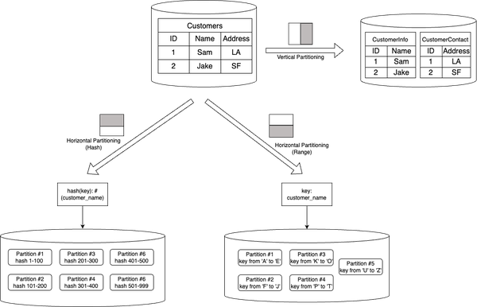

# Content
- Data Storage Format
- Relational Databases

## Data Storage Format
 
### File Storage
- File storage refers to the storage of data in a folder, just like how paper documents are kept in a filing cabinet. When the data is needed, the computer must know the path to find it.
- It is the oldest and most widely used data storage system for direct and network-attached systems, great for storing complex files and easier to navigate compared to other formats due to the logical hierarchy.
- **AWS Elastic File Store (EFS)** is a scalable, fully managed file storage service offering by AWS that provides shared file storage for EC2 instances, enabling multiple instances to access the same data concurrently, making it suitable for applications requiring shared access to files. 

### Block Storage
- Block-based storage organizes data into fixed-size blocks or pages, which are stored on disk or flash memory. Each block is assigned a unique address, and data can be read or written to individual blocks.
- Block storage is designed to separate the data from the user’s environment and distribute it across multiple environments that are better suited to serve the data. E.g. some block data can be on a Windows environment, some on a Linux environment.
- The caveat with Block storage is that it can be expensive. It has limited capability to handle metadata, which means it needs to be dealt with at the application or database level, adding another complexity for a developer or systems administrator to worry about.
- **AWS Elastic Block Storage (EBS)** offers scalable block storage volumes on AWS cloud that can be attached to EC2 instances, providing durable, high-performance storage for applications that require low-latency access to data, such as databases and applications that need block-level storage. 
### Object Storage
- Data is broken down into discrete units called objects and kept in a single repository, rather than in traditional file and folder structures or server blocks.
- These objects are stored across distributed hardware and are accessed using a unique identifier and metadata that describes the data, including information like age, security and access contingencies, and even details like the location equipment used to create a video file.
- Object storage is also known for its scalability, cost efficiency, and suitability for static data and unstructured data. It has a simple HTTP API that is used by most clients in all programming languages.
- Object storage does not work well with traditional databases because writing objects is a slow process and programming an app to use object storage API is not as straightforward as using file storage.
- **AWS S3 (Simple Storage Service)** is an object storage service offering by AWS that provides highly scalable and durable storage for a wide range of data types, accessible via APIs. It is suitable for storing and retrieving large amounts of data, backups, static website content, and as a data lake for analytics.

### Conclusion
- File-based storage is best suited for structured data, while block-based and object-based storage are more appropriate for unstructured data. 
- Block-based storage provides better performance and reliability than file-based storage, while object-based storage offers better scalability and cost-effectiveness.

- Database management systems (DBMS) acts as a bridge between the database and users. 
- Databases can be classified into two major types, based on their structure, usage, and functionality: relational and non-relational databases. 

## Relational Databases
- **Tables** in a relational database are organized into **rows** and **columns**, similar to a spreadsheet.
    - Rows, also known as *records* or *tuples*, represent individual instances of data stored in a table. 
    - Columns, also known as *fields* or *attributes*, represent the specific properties or characteristics of the data stored in a table. 
- **Indexes** are data structures that enhance the performance of queries by providing quick access to specific data within a table.
- **Constraints** enforce rules and conditions on the data stored in a database. Common constraints include primary key constraints, foreign key constraints, unique constraints, and check constraints.
- **Views** are virtual tables derived from the data stored in one or more tables. They are created based on predefined queries and provide a way to present data in a customized or simplified manner without altering the underlying tables. 
- Relational databases use **transactions** to keep their state consistent. In the context of database management systems, a transaction is a logical unit of work that represents a series of operations performed on a database as a single indivisible unit. The **ACID** (Atomicity, Consistency, Isolation, Durability) properties govern the behavior of transactions.

### Relational Database Concepts
- SQL:

    - Relational databases use a structured query language (SQL) to manipulate and retrieve data. SQL allows users to create, modify, and query databases using a set of commands.
- Schema Normalization:

    - Schema normalization is the process of organizing data in a database to reduce redundancy and improve data integrity.
    

### Relational Database Management System Architecture

- The catalog, also known as the data dictionary or metadata repository, stores the metadata about the database schema, tables, columns, indexes, constraints, and other database objects. It provides information about the structure and organization of the database, allowing the RDBMS to interpret and manipulate the data accurately.

### Optimizing Relational Databases
- Indexes
    - A primary index is an index that is created on a table’s primary key. 
    - A secondary index is an index that is created on a non-primary key column or set of columns. 
    - B+ trees are widely used in RDBMS as an efficient indexing structure for facilitating fast data retrieval and efficient query processing. The B+ tree data structure provides efficient key-based searching and range queries on large amounts of data.

- SQL Tuning
    - Method 1: Minimizing large write operations as performing operations such as writing, modifying, deleting, or importing extensive amounts of data can have a significant impact on the performance of queries.
    - Method 2: Schedule query execution during off-peak hours.
    - Method 3: JOIN elimination. By dividing a single query into several separate queries that can be joined later, unnecessary joins, subqueries, and tables can be eliminated.

- Denormalization
    - Denormalization is the technique aimed at improving read performance, although it may come at the cost of reduced write performance. It involves duplicating data across multiple tables to avoid costly joins.
    - It introduces trade-offs in terms of data redundancy and increased complexity in database management.

- Query Federation
    - Query federation is a technique that involves splitting a large query into smaller queries that can be executed independently on different database servers. This technique requires schema federation, i.e. functional partitioning of the database across multiple database servers. By executing smaller queries on different servers, the overall query execution time can be reduced, resulting in faster query results.

### Scaling Relational Databases
- Partitioning
 
    - Partitioning is the process of dividing a large database table into smaller, more manageable parts called partitions.
    - Each partition operates as an independent database, capable of executing read and write operations autonomously. 
- Sharding

    - Sharding is the process of distributing a large database across multiple servers. Each server contains a subset of the data, and queries are distributed across all servers.
    - Sharding is useful for scaling databases that have become too large to be managed on a single server.
    - Sharding offers similar advantages to federation, including reduced read and write traffic, decreased replication, and improved cache utilization. It also helps reduce the size of indexes, leading to faster query performance. 
    - In the event of a shard failure, the other shards remain operational, although implementing replication is crucial to prevent data loss.
    - Common approaches to shard a customer table include using the customer’s last name, initial, or geographic location.
    - Data distribution can become unbalanced, particularly if a shard has a subset of power customers, leading to increased load on that particular shard.
- Replication
    - Replication is the process of copying data from one database server to another. Every node that stores a copy of the data is called a *replica*.
    -  Replication ensures high availability by storing data copies on multiple host machines. In the event of a failure or downtime of one host machine, the database can seamlessly redirect read and write operations to other live machines that hold replicated data.
    - With replication, the database can distribute read and write queries across multiple host machines. This load distribution strategy prevents overburdening of individual machines, thereby improving the overall system performance and scalability.
    - Replicating data across geographically distributed host machines allows for placing the replicated copies closer to end users. This proximity reduces the network latency experienced by users when accessing the database. 

### Open-source Relational Database Systems
- MySQL
- PostgreSQL 
 

- **AWS Relational Database Services (RDS)** offers multiple options  by providing various database engine versions (commonly referred to as “flavors”), instance classes, and storage types. These flavors are essentially different configurations of managed database engines, each optimized for specific use cases and workloads. AWS RDS supports several popular relational database engines, including MySQL, PostgreSQL, Oracle, SQL Server, and MariaDB.