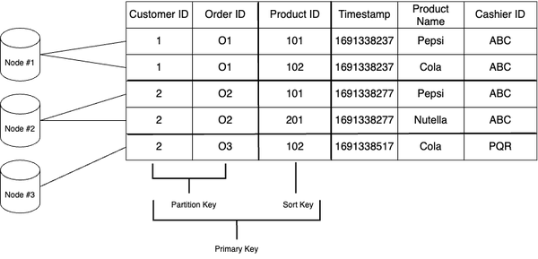
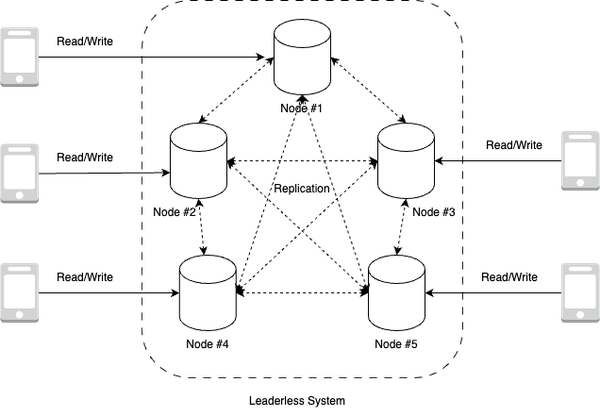
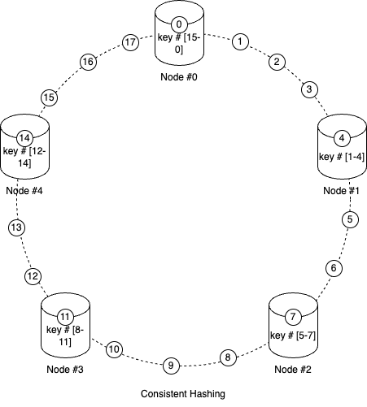

# Content
- Non-relational Database Concepts
- Key Value Databases
- Document Databases
- Columnar Databases
- Graph Databases
- Conclusion

## Non-relational Database Concepts
- **Schema Flexibility**: data can be stored without the need to pre-define a strict structure
- **Data Models**: non-relational databases support various data models; The  most common data models include: 

    - Document Stores: often in formats like JSON or BSON
    - Key-Value Stores: commonly used for caching and high-speed data retrieval
    - Column-Family Stores: allow efficient storage and retrieval of large volumes of data, especially in analytical and data warehousing scenarios
    - Graph Databases: focus on relationships between data entities

- **Scalability**: non-relational databases are designed to scale horizontally, distributing data across multiple nodes or servers; scaling is achieved through techniques like sharding and replication

- **High Availability and Fault Tolerance**: often designed to handle hardware failures, network partitions, and other disruptions without compromising data integrity or accessibility

- **BASE**: BASE stands for *Basically Available*, *Soft state*, *Eventually consistent*. BASE is particularly relevant in distributed and large-scale systems where high availability and scalability are key requirements, often at the expense of strict strong consistency

## Key Value Databases
- In a key-value store, the primary key, partition key, and sort key are fundamental concepts that help organize and retrieve data efficiently.
  
    

    - Primary Key: a unique identifier associated with each key-value pair in the key-value store; it serves as the primary means of accessing and retrieving data
    - Partition Key: a subset of the primary key that determines how this data is distributed across these different partitions. It essentially answers the question: “Which partition (or node) should store this particular piece of data?”
    - Sort Key(Range Key): an optional attribute used to order or sort the data within a partition. The sort key is particularly useful when you want to query a range of data based on a specific criterion, such as retrieving all records with timestamps within a certain range or retrieving data in alphabetical or numerical order.

- Data Access and Retrieval Operations

    - *GetItem*: retrieve the attributes of an item associated with a given primary key
    - *PutItem*: insert an item into the store
    - *UpdateItem*: modify an existing item
    - *DeleteItem*: remove an item from the key-value store

- Scaling Key Value Stores

    - Distributed key-value stores employ techniques such as leaderless replication using consistent hashing or partitioning algorithms to evenly distribute the data across the nodes.

        - Leaderless Replication

            - Instead of having a dedicated leader responsible for coordinating read and write operations, all nodes in the system, as shown below are equal and can accept client requests independently
                

            - Leaderless replication provides high availability and fault tolerance because the system can continue operating even if some nodes become unavailable. Clients can send requests to any available node, and the system handles the replication and coordination transparently

        - Consistent Hashing

            - introduce a ring-like structure that represents the set of nodes in the system. Each node is assigned a position on the ring using a hash function. Data is also hashed to a position on the ring. The node whose position is the closest clockwise to the data’s position becomes responsible for storing or serving that data
                
            
            - The key advantage of consistent hashing is that when a node is added or removed, only a fraction of the data needs to be remapped to new nodes. This makes consistent hashing highly scalable and efficient in distributed environments.
- Advantages, Trade-offs and Considerations
    - One of the primary advantages of key-value stores is their ability to deliver high performance and low-latency access to data.
    - One of the major considerations is the limited querying capabilities. Key-value stores are optimized for simple key-based lookups and lack the advanced querying capabilities provided by relational databases.
    - AWS offers Amazon DynamoDB

