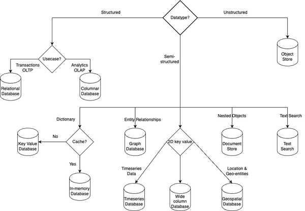

# Content
- Non-relational Database Concepts
- Key Value Databases
- Document Databases
- Columnar Databases
- Graph Databases
- Conclusion

## Non-relational Database Concepts
- **Schema Flexibility**: data can be stored without the need to pre-define a strict structure
- **Data Models**: non-relational databases support various data models; The  most common data models include: 

    - Document Stores: often in formats like JSON or BSON
    - Key-Value Stores: commonly used for caching and high-speed data retrieval
    - Column-Family Stores: allow efficient storage and retrieval of large volumes of data, especially in analytical and data warehousing scenarios
    - Graph Databases: focus on relationships between data entities

- **Scalability**: non-relational databases are designed to scale horizontally, distributing data across multiple nodes or servers; scaling is achieved through techniques like sharding and replication

- **High Availability and Fault Tolerance**: often designed to handle hardware failures, network partitions, and other disruptions without compromising data integrity or accessibility

- **BASE**: BASE stands for *Basically Available*, *Soft state*, *Eventually consistent*. BASE is particularly relevant in distributed and large-scale systems where high availability and scalability are key requirements, often at the expense of strict strong consistency

## Key Value Databases
- In a key-value store, the primary key, partition key, and sort key are fundamental concepts that help organize and retrieve data efficiently
  
    

    - Primary Key: a unique identifier associated with each key-value pair in the key-value store; it serves as the primary means of accessing and retrieving data
    - Partition Key: a subset of the primary key that determines how this data is distributed across these different partitions. It essentially answers the question: “Which partition (or node) should store this particular piece of data?”
    - Sort Key(Range Key): an optional attribute used to order or sort the data within a partition. The sort key is particularly useful when you want to query a range of data based on a specific criterion, such as retrieving all records with timestamps within a certain range or retrieving data in alphabetical or numerical order

- Data Access and Retrieval Operations

    - *GetItem*: retrieve the attributes of an item associated with a given primary key
    - *PutItem*: insert an item into the store
    - *UpdateItem*: modify an existing item
    - *DeleteItem*: remove an item from the key-value store

- Scaling Key Value Stores

    - Distributed key-value stores employ techniques such as leaderless replication using consistent hashing or partitioning algorithms to evenly distribute the data across the nodes

        - Leaderless Replication

            - Instead of having a dedicated leader responsible for coordinating read and write operations, all nodes in the system, as shown below are equal and can accept client requests independently
                

            - Leaderless replication provides high availability and fault tolerance because the system can continue operating even if some nodes become unavailable. Clients can send requests to any available node, and the system handles the replication and coordination transparently

        - Consistent Hashing

            - introduce a ring-like structure that represents the set of nodes in the system. Each node is assigned a position on the ring using a hash function. Data is also hashed to a position on the ring. The node whose position is the closest clockwise to the data’s position becomes responsible for storing or serving that data
                
            
            - The key advantage of consistent hashing is that when a node is added or removed, only a fraction of the data needs to be remapped to new nodes. This makes consistent hashing highly scalable and efficient in distributed environments
- Advantages, Trade-offs and Considerations
    - One of the primary advantages of key-value stores is their ability to deliver high performance and low-latency access to data
    - One of the major considerations is the limited querying capabilities. Key-value stores are optimized for simple key-based lookups and lack the advanced querying capabilities provided by relational databases
    - AWS offers Amazon DynamoDB

## Document Databases
- Document databases provide a flexible and schema-less approach to data storage, making them ideal for applications with dynamic and evolving data structures, typically represented in formats such as `JSON`, `BSON`, or `XML`
    - Collections: containers that hold related documents. For example, in an e-commerce application, you might have collections for products, orders, and customers
    - Documents: a document is a JSON-like structure that stores data as key-value pairs. It represents a single entity or record and can contain nested structures and arrays
    - Operators: `Insert`, `Update`, `Delete`, `Query`, `Aggregation`

- **Projection** is a powerful feature in document stores that allows you to retrieve only the desired fields from a document. Indexing mechanisms, such as secondary indexes, are commonly used to optimize query performance

- Document stores employ various mechanisms to achieve availability. There are three key components: *replica sets*, *primary-secondary node clusters*, and the *heartbeat mechanism*

    - Replica Sets: a replica set is a group of nodes in a document store that contains multiple copies of the data. Each replica set consists of a primary node and one or more secondary nodes. The primary node is responsible for handling write operations and acting as the primary source of data. Secondary nodes replicate data from the primary node and serve as backups

    - Primary-Secondary Node Clusters: the primary node accepts write operations and maintains the authoritative copy of the data. Secondary nodes replicate the data from the primary node and serve as read replicas. Clients can read from any of the secondary nodes, distributing the read workload and improving read performance

    - Heartbeat Mechanism: is like a regular check-up system where each server periodically confirms it’s active and functioning. If one server doesn’t respond, the database assumes it’s not working and automatically takes steps to keep your data safe and accessible

- Advantages, Trade-offs and Considerations
    - They excel in scenarios where flexibility in data modeling, dynamic schema evolution, and efficient querying of complex data structures are paramount
    - Document stores also facilitate the storage and retrieval of unstructured or semi-structured data, making them suitable for scenarios involving user-generated content, sensor data, log files, and social media feeds
    - The flexibility of the schema-less design can sometimes lead to data consistency challenges, as the enforcement of data integrity constraints may be delegated to the application layer
    - MongoDB is an example 

## Columnar Databases
- Columnar (wide column) databases are a type of non-relational database optimized for handling large amounts of structured and semi-structured data across distributed systems, enabling fast read/write performance and efficient analytics by storing data in columns rather than rows
- Since each column is stored separately, column-oriented storage allows for better compression ratios. Compression can be applied individually to each column based on its data characteristics, such as data type or redundancy. This not only reduces storage requirements but also improves data access speed by reducing disk I/O and memory footprint
- The schema design in a wide column store is flexible, enabling the addition or removal of columns without altering the entire dataset. This flexibility allows for easy adaptation to changing business requirements and evolving data models
- The schema design in a wide column store is flexible, enabling the addition or removal of columns without altering the entire dataset. This flexibility allows for easy adaptation to changing business requirements and evolving data models
- Wide column stores typically use two types of keys
    - Partition Key: used to distribute data across the nodes in a cluster. It determines the physical location where data is stored

    - Clustering Key: used to define the order of data within a partition. It allows for efficient sorting and range-based queries within a partition

        - **Partition key** should be chosen on a column with high cardinality, aiming for even data distribution, while **clustering key** should be chosen based on query access pattern of the application depending on how data is retrieved in specific order or pattern 

- Wide column (column-family) databases typically offer **tunable** consistency levels, allowing you to configure the degree of consistency from eventual to strong consistency depending on your application’s requirements
- Columnar Store Architecture (may vary from one implementation to other but in general it looks like this):

    - Commit Log: a write-ahead log that records all write operations performed on the database. It ensures that no data is lost in the event of a system failure or crash
    - Memtable: an in-memory data structure that stores recent write operations before they are flushed to disk. It acts as a write buffer, temporarily holding the data in memory before persisting it to disk in an efficient manner. As the memtable fills up, it is periodically flushed to disk, creating SSTables
    - SSTables(Sorted String Tables): the immutable, on-disk data structures sorted by key that store key-value pairs efficiently for fast reads, range queries, and data compression, while Bloom filters quickly check if an SSTable contains specific partition data, trading some accuracy for improved performance
    - Compaction Strategies: Compaction is the process of merging and compacting multiple SSTables to improve read performance and manage disk space. Various compaction strategies are employed to balance read and write performance, as well as disk space utilization
        - Size Tiered Compaction: groups SSTables into levels based on their size
        - Leveled Compaction: SSTables are organized into multiple levels, with each level containing SSTables of roughly equal size
        - TimeWindow Compaction:  specifically designed for time-series data; It allows for efficient expiration of old data by dropping or merging SSTables based on time-based criteria
    - Tombstones for Soft Delete: Tombstones are markers created during soft deletes in columnar databases to indicate deleted data, which ensures data consistency during compaction and read operations, but excessive tombstones can lead to slower query performance, increased latency, and higher storage consumption, making effective tombstone management crucial for maintaining overall database performance and responsiveness

- Advantages, Trade-offs and Considerations
    - Wide column stores find widespread use in various domains, particularly in analytics, big data processing, and time-series data. They are well-suited for applications that involve complex queries, ad hoc analysis, data warehousing, and high-speed data ingestion. Use cases include log analysis, financial analytics, real-time reporting, IoT data processing, and customer behavior analysis
    - Due to their distributed nature and complex data organization, they often require more advanced data modeling and query optimization compared to traditional relational databases
    - Apache Cassandra, Amazon Keyspaces

## Graph Databases
- Graph databases are a specialized type of non-relational database designed to handle highly interconnected data and complex relationships
- Unlike traditional databases that focus on data entities and their attributes, graph stores prioritize the relationships between entities
- Graph databases often utilize caching mechanisms to store frequently accessed graph elements in memory, further improving query response times
- Advantages, Trade-offs and Considerations
    - Graph stores are particularly well-suited for applications that involve complex relationships, network analysis, and recommendation systems. They find extensive use in social networking platforms, fraud detection systems, recommendation engines, knowledge graphs, and data lineage analysis
    - The performance of graph queries heavily depends on the size and structure of the graph, and certain complex queries may require additional optimization techniques
    - Neo4j(Cypher), Amazon Neptune

## Conclusion
