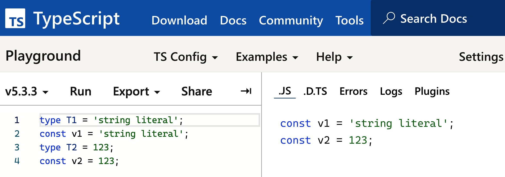
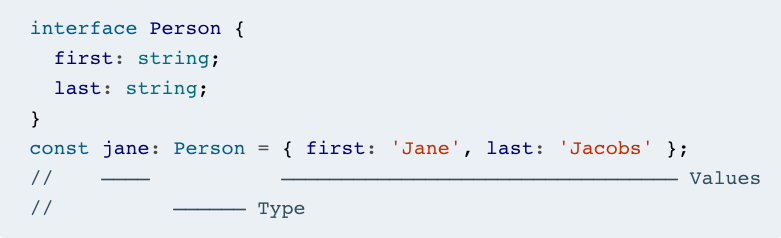

# Content
- Use Your Editor to Interrogate and Explore the Type System
- Think of Types as Sets of Values
- Know How to Tell Whether a Symbol Is in the Type Space or Value Space
- Prefer Type Annotations to Type Assertions
- Avoid Object Wrapper Types (String, Number, Boolean, Symbol, BigInt)
- Distinguish Excess Property Checking from Type Checking
- Apply Types to Entire Function Expressions When Possible
- Know the Differences Between `type` and `interface`
- Use `readonly` to Avoid Errors Associated with Mutation
- Use Type Operations and Generic Types to Avoid Repeating Yourself
- Prefer More Precise Alternatives to Index Signatures
- Avoid Numeric Index Signatures

## Use Your Editor to Interrogate and Explore the Type System
- When you install TypeScript, you get two executables:
    - `tsc`, the TypeScript compiler
    - `tsserver`, the TypeScript standalone server; it provides language services, including autocomplete, inspection, navigation, and refactoring.
- Use your editor to build an intuition for how the type system works and how TypeScript infers types.
- Familiarize yourself with TypeScript’s refactoring tools, e.g., renaming symbols and files.

## Think of Types as Sets of Values
- Before your code runs, when TypeScript is checking it for errors, a variable just has a type. This is best thought of as a set of possible values.
- The smallest set is the empty set, which contains no values. It corresponds to the `never` type (sometimes called buttom type) in TypeScript. 
- For example:
    ```
    interface Person {
        name: string;
    }
    interface Lifespan {
        birth: Date;
        death?: Date;
    }
    type PersonSpan = Person & Lifespan;
    ```
    - Types as Sets of Values: Imagine each type as a set of possible values rather than just a collection of properties. For example, a type `Person` represents all values that have a name property of type string.
    - Intersection of Types: When you use the & operator between two types, it creates a new type that represents the intersection of the sets of values of those types. This means that the new type (`PersonSpan` in this case) includes values that satisfy both original types (`Person` and `Lifespan`).
    - Misconception about Intersection: Initially, you might think that `Person` & `Lifespan` results in an empty set because the interfaces `Person` and `Lifespan` have no overlapping properties. However, type operations consider the set of values rather than the specific properties.
        - So a value that has the properties of both `Person` and `Lifespan` will belong to the intersection type:
            ```
            const ps: PersonSpan = {
                name: 'Alan Turing',
                birth: new Date('1912/06/23'),
                death: new Date('1954/06/07'),
            };  // OK
            ```
    - Of course, a value could have more than those three properties and still belong to the type! The general rule is that the values in an intersection type contain the union of properties in each of its constituents.
    - A more idiomatic way to write the `PersonSpan` type would be with extends:
        ```
        interface Person {
            name: string;
        }
        interface PersonSpan extends Person {
            birth: Date;
            death?: Date;
        }
        ```
- An object is considered to belong to a type as long as it has at least the required properties specified by that type. For example, 
    ```
    interface Person {
        name: string;
    }

    const john = { 
        name: "John", 
        age: 30, 
        address: "123 Main St" 
    };
    ```

    - `john` has extra properties (`age` and `address`) not defined in the `Person` type, but it still satisfies the `Person` type because it has the `name` property.

## Know How to Tell Whether a Symbol Is in the Type Space or Value Space
- The symbols after a type or interface are in type space, while those introduced in a const or let declaration are values. For example, 
    ```
    type T1 = 'string literal';
    const v1 = 'string literal';
    type T2 = 123;
    const v2 = 123;
    ```
- Types are erased during compilation, so if a symbol disappears then it was in type space. For example, 
-  The symbols after a type declaration (:) or an assertion (as) are in type space, while everything after an = in an assignment is in value space. For example, 
- There are many operators and keywords that mean different things in a type or value context. `typeof`, for instance:
    ```
    type T1 = typeof jane;
    //   ^? type T1 = Person
    type T2 = typeof email;
    //   ^? type T2 = (to: Person, subject: string, body: string) => Response

    const v1 = typeof jane;  // Value is "object"
    const v2 = typeof email;  // Value is "function"
    ```
    
    - In a type context, `typeof` takes a value and returns its TypeScript type.
    - In a value context, `typeof` is JavaScript’s runtime `typeof` operator. It returns a string containing the runtime type of the symbol.
        - JavaScript’s `typeof` operator only has eight possible return values: "string", "number", "boolean", "undefined", "object", "function", "symbol", and "bigint"

- There are many other constructs that have different meanings in the two spaces:
    - `this` in value space is JavaScript’s `this` keyword. As a type, `this` is the TypeScript type of `this`, aka “polymorphic this.” It’s helpful for implementing method chains with subclasses. E.g.
        ```
        class A {
            setName(name: string): this {
                // Logic to set the name
                return this;  // Returning `this` type means returning the current object type
            }
        }

        class B extends A {
            setAge(age: number): this {
                // Logic to set the age
                return this;  // Also returning `this` type to ensure method chaining keeps the correct class type
            }
        }

        const b = new B();
        b.setName("John").setAge(30);  // Method chaining
        ```
    - In value space, `&` and `|` are bitwise AND and OR. In type space they are the intersection and union operators.
    - In value space, `const` introduces a new variable, but in type space, as `const` changes the inferred type of a literal or literal expression.
    - In value space, `extends` defines a subclass (`class A extends B`), but in type space it defines a subtype (`interface A extends B`) or a constraint on a generic type (`Generic<T extends number>`).
    - In value space, "in" is used in for loops (for (key in object)), while in type space it’s used in mapped types.
    - In value space, *!* is JavaScript’s logical not operator (!x), but in type space it’s a non-null type assertion.
- Function declaration in TypeScript: separate the types and values, e.g. 
    ```
    function email(
    { to, subject, body }: { to: Person, subject: string, body: string }
    ) {
    // ...
    }
    ```

## Prefer Type Annotations to Type Assertions
## Avoid Object Wrapper Types (String, Number, Boolean, Symbol, BigInt)
## Distinguish Excess Property Checking from Type Checking
## Apply Types to Entire Function Expressions When Possible
## Know the Differences Between `type` and `interface`
## Use `readonly` to Avoid Errors Associated with Mutation
## Use Type Operations and Generic Types to Avoid Repeating Yourself
## Prefer More Precise Alternatives to Index Signatures
## Avoid Numeric Index Signatures